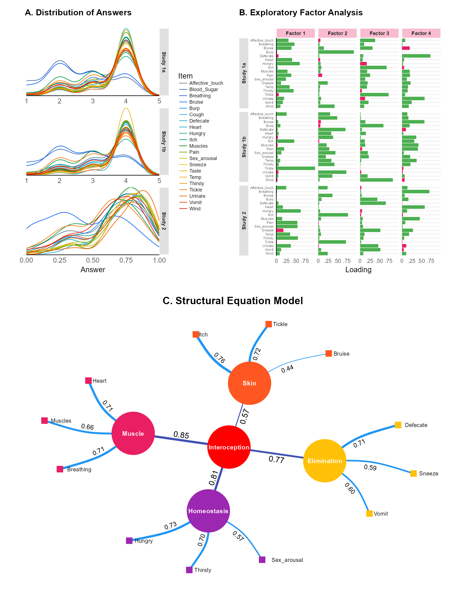
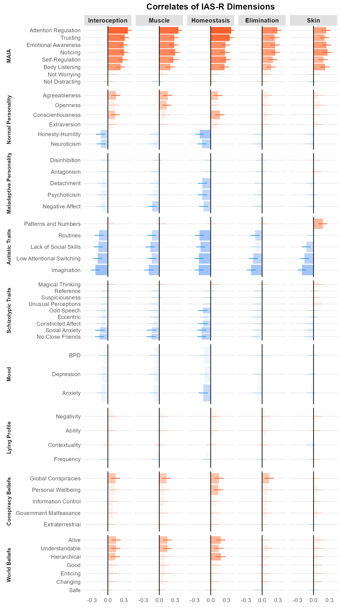

# Interoceptive Accuracy Scale Revised (IAS-R)

A reanalysis of Murphy, J., Brewer, R., Plans, D., Khalsa, S. S., Catmur, C., & Bird, G. (2020). [Testing the independence of self-reported interoceptive accuracy and attention](https://journals.sagepub.com/doi/full/10.1177/1747021819879826). Quarterly Journal of Experimental Psychology, 73(1), 115-133. https://doi.org/10.31234/osf.io/fqgu4

- [**Results (old)**](https://realitybending.github.io/InteroceptionIAS/analysis/old/analysis.html)

