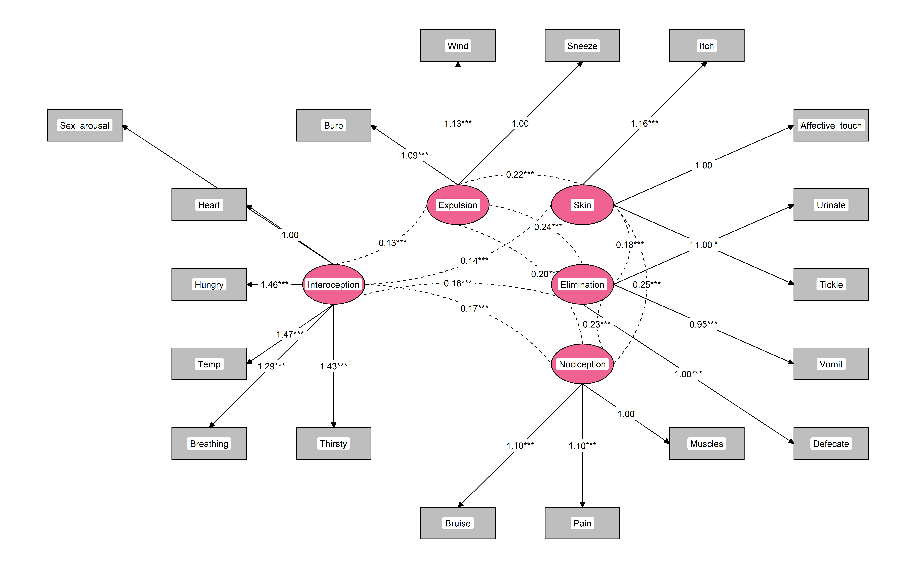

# Interoceptive Accuracy Scale Re-analysed (IAS-R)

-   Murphy, J., Brewer, R., Plans, D., Khalsa, S. S., Catmur, C., &
    Bird, G. (2020). [Testing the independence of self-reported
    interoceptive accuracy and
    attention](https://journals.sagepub.com/doi/full/10.1177/1747021819879826).
    Quarterly Journal of Experimental Psychology, 73(1), 115-133.
    <https://doi.org/10.31234/osf.io/fqgu4>

**Aim**. Re-analyze the raw data from [Murphy et
al. (2020)](https://journals.sagepub.com/doi/full/10.1177/1747021819879826)
(study 1) regarding the factor structure of the Interoceptive Accuracy
Scale (IAS) by using the *Method Agreement Procedure* for the number of
factors to extract and performing a CFA model comparison.

**Conclusion**. EFA suggested a 1-factor and 4-factors solutions, but
the latter was favoured by CFA. Additionally, CFA suggested that a
5-factors model (obtained by separating *Nociception* from
*Interoception*) was superior:

-   *Interoception*: Heart, Hungry, Breathing, Thirsty, Temperature,
    Sexual arousal.
-   *Nociception*: Muscles, Bruise, Pain.
-   *Expulsion*: Burp, Sneeze, Wind.
-   *Elimination*: Vomit, Defecate, Urinate.
-   *Skin*: Itch, Tickle, Affective touch.

The final revised scale, made of 18 items (6 for interoception and 3 per
secondary dimension), is available below.

## Data

Data from the [study
1](https://osf.io/3m5nh/?view_only=a68051df4abe4ecb992f22dc8c17f769) was
downloaded from OSF.

``` r
library(tidyverse)
library(easystats)

df <- haven::read_sav("Study 1.sav") |> 
  mutate_all(as.numeric) |> 
  mutate(Gender = as.character(ifelse(Gender == 1, "Male", "Female")))
  
report::report_participants(df, age = "Age", sex = NA, gender = "Gender")
```

\[1\] “451 participants (Mean age = 25.8, SD = 8.4, range: \[18, 69\];
Gender: 70.5% women, 29.5% men, 0.00% non-binary)”

## EFA

``` r
data <- select(df, -Age, -Gender)

n <- parameters::n_factors(data)

n
# # Method Agreement Procedure:
# 
# The choice of 1 dimensions is supported by 5 (26.32%) methods out of 19 (Bentler, Acceleration factor, Scree (R2), VSS complexity 1, Velicer's MAP).
plot(n)
```

<!-- -->

The *Method Agreement Procedure*

``` r
efa1 <- parameters::factor_analysis(data, n=1, sort = TRUE)
efa1
# # Loadings from Factor Analysis (no rotation)
# 
# Variable        | MR1  | Complexity | Uniqueness
# ------------------------------------------------
# Pain            | 0.60 |    1.00    |    0.64   
# Sneeze          | 0.59 |    1.00    |    0.65   
# Temp            | 0.57 |    1.00    |    0.67   
# Wind            | 0.57 |    1.00    |    0.68   
# Affective_touch | 0.56 |    1.00    |    0.69   
# Muscles         | 0.55 |    1.00    |    0.69   
# Tickle          | 0.54 |    1.00    |    0.70   
# Itch            | 0.54 |    1.00    |    0.71   
# Defecate        | 0.54 |    1.00    |    0.71   
# Vomit           | 0.54 |    1.00    |    0.71   
# Taste           | 0.53 |    1.00    |    0.72   
# Cough           | 0.53 |    1.00    |    0.72   
# Bruise          | 0.52 |    1.00    |    0.73   
# Burp            | 0.52 |    1.00    |    0.73   
# Urinate         | 0.50 |    1.00    |    0.75   
# Breathing       | 0.50 |    1.00    |    0.75   
# Thirsty         | 0.44 |    1.00    |    0.81   
# Sex_arousal     | 0.41 |    1.00    |    0.83   
# Hungry          | 0.41 |    1.00    |    0.84   
# Heart           | 0.39 |    1.00    |    0.85   
# Blood_Sugar     | 0.38 |    1.00    |    0.86   
# 
# The unique latent factor accounted for 26.51% of the total variance of the original data.

efa4 <- parameters::factor_analysis(data, n=4, rotation = "oblimin", sort = TRUE)
efa4
# # Rotated loadings from Factor Analysis (oblimin-rotation)
# 
# Variable        |    MR2    |  MR3  |    MR1    |    MR4    | Complexity | Uniqueness
# -------------------------------------------------------------------------------------
# Tickle          |   0.72    | 0.03  |   -0.10   |   0.11    |    1.09    |    0.47   
# Itch            |   0.67    | 0.14  | -9.44e-03 |   -0.10   |    1.13    |    0.46   
# Affective_touch |   0.49    | -0.13 |   0.29    |   0.13    |    1.97    |    0.59   
# Blood_Sugar     |   0.29    | 0.21  |   0.18    |   -0.23   |    3.51    |    0.75   
# Burp            |   -0.03   | 0.73  |   -0.03   | -1.21e-03 |    1.00    |    0.50   
# Cough           | 7.56e-03  | 0.69  | 7.00e-03  |   -0.01   |    1.00    |    0.52   
# Sneeze          |   0.07    | 0.54  | 7.09e-03  |   0.20    |    1.30    |    0.55   
# Wind            |   0.08    | 0.46  |   0.07    |   0.16    |    1.37    |    0.62   
# Hungry          |   -0.16   | 0.04  |   0.65    |   0.03    |    1.13    |    0.60   
# Thirsty         | -4.84e-03 | 0.01  |   0.49    |   0.11    |    1.11    |    0.70   
# Breathing       |   0.14    | 0.05  |   0.44    |   0.03    |    1.24    |    0.70   
# Heart           |   0.11    | -0.07 |   0.40    |   0.08    |    1.32    |    0.78   
# Bruise          |   0.31    | 0.25  |   0.34    |   -0.25   |    3.74    |    0.59   
# Pain            |   0.29    | 0.01  |   0.32    |   0.20    |    2.67    |    0.61   
# Temp            |   0.19    | 0.13  |   0.29    |   0.16    |    2.91    |    0.67   
# Muscles         |   0.20    | 0.13  |   0.26    |   0.16    |    3.24    |    0.69   
# Sex_arousal     |   0.18    | 0.02  |   0.21    |   0.15    |    2.81    |    0.82   
# Defecate        |   0.10    | 0.11  | 2.77e-03  |   0.66    |    1.10    |    0.46   
# Urinate         |   -0.11   | 0.13  |   0.24    |   0.52    |    1.65    |    0.54   
# Taste           |   0.23    | 0.06  |   0.17    |   0.30    |    2.60    |    0.69   
# Vomit           |   0.21    | 0.18  |   0.11    |   0.25    |    3.26    |    0.71   
# 
# The 4 latent factors (oblimin rotation) accounted for 37.94% of the total variance of the original data (MR2 = 10.46%, MR3 = 10.17%, MR1 = 10.08%, MR4 = 7.23%).
```

## CFA

We compared the two models suggested by EFA (1-factor and 4-factors),
with two additional model based on the latter: one with 2 items removed
(Blood sugar and Taste), and one with additionally the *Interoception*
factor split into two (with the pain-related items grouped together).

``` r
library(lavaan)

cfa1 <- lavaan::cfa(parameters::efa_to_cfa(efa1, 
                                           names="IAS"), data=data)
cfa4 <- lavaan::cfa(parameters::efa_to_cfa(efa4, 
                                           names=c("Skin", "Expulsion", "Interoception", "Elimination"),
                                           threshold = "max"), data=data)

cfa4mod <- "
Skin =~ Affective_touch + Tickle + Itch
Expulsion =~ Sneeze + Cough + Wind + Burp
Interoception =~ Heart + Hungry + Breathing + Thirsty + Temp + Sex_arousal + Muscles + Bruise + Pain
Elimination =~ Urinate + Defecate + Vomit
" |> 
lavaan::cfa(data=data)

cfa5 <- "
Skin =~ Affective_touch + Tickle + Itch
Expulsion =~ Sneeze + Cough + Wind + Burp
Interoception =~ Heart + Hungry + Breathing + Thirsty + Temp + Sex_arousal
Nociception =~ Muscles + Bruise + Pain
Elimination =~ Urinate + Defecate + Vomit
" |> 
lavaan::cfa(data=data)

anova(cfa1, cfa4, cfa4mod, cfa5)
# Chi-Squared Difference Test
# 
#          Df   AIC   BIC Chisq Chisq diff Df diff Pr(>Chisq)    
# cfa5    142 21353 21551   441                                  
# cfa4mod 146 21374 21555   469       28.8       4    8.4e-06 ***
# cfa4    183 23648 23846   545       75.6      37    0.00019 ***
# cfa1    189 23868 24041   777      231.9       6    < 2e-16 ***
# ---
# Signif. codes:  0 '***' 0.001 '**' 0.01 '*' 0.05 '.' 0.1 ' ' 1
```

## Final Model

Additionally, we removed the least loaded items of expulsion (cough) to
improve the balance (3 items per secondary scales, and 6 for
interoception).

``` r
cfa5mod <- "
Skin =~ Affective_touch + Tickle + Itch
Expulsion =~ Sneeze + Wind + Burp
Interoception =~ Heart + Hungry + Breathing + Thirsty + Temp + Sex_arousal
Nociception =~ Muscles + Bruise + Pain
Elimination =~ Urinate + Defecate + Vomit
" |> 
lavaan::cfa(data=data)

anova(cfa5, cfa5mod)
# Chi-Squared Difference Test
# 
#          Df   AIC   BIC Chisq Chisq diff Df diff Pr(>Chisq)    
# cfa5mod 125 20363 20552   379                                  
# cfa5    142 21353 21551   441       61.4      17    6.1e-07 ***
# ---
# Signif. codes:  0 '***' 0.001 '**' 0.01 '*' 0.05 '.' 0.1 ' ' 1
```

``` r
parameters::parameters(cfa5) |> 
  display()
```

| Link                          | Coefficient |  SE  |    95% CI    |   z   |    p    |
|:------------------------------|:-----------:|:----:|:------------:|:-----:|:-------:|
| Skin =\~ Affective_touch      |    1.00     | 0.00 | (1.00, 1.00) |       | \< .001 |
| Skin =\~ Tickle               |    1.21     | 0.12 | (0.98, 1.43) | 10.48 | \< .001 |
| Skin =\~ Itch                 |    1.18     | 0.11 | (0.96, 1.40) | 10.34 | \< .001 |
| Expulsion =\~ Sneeze          |    1.00     | 0.00 | (1.00, 1.00) |       | \< .001 |
| Expulsion =\~ Cough           |    0.95     | 0.08 | (0.79, 1.11) | 11.45 | \< .001 |
| Expulsion =\~ Wind            |    0.96     | 0.09 | (0.79, 1.13) | 10.97 | \< .001 |
| Expulsion =\~ Burp            |    1.01     | 0.09 | (0.84, 1.18) | 11.53 | \< .001 |
| Interoception =\~ Heart       |    1.00     | 0.00 | (1.00, 1.00) |       | \< .001 |
| Interoception =\~ Hungry      |    1.46     | 0.20 | (1.06, 1.86) | 7.13  | \< .001 |
| Interoception =\~ Breathing   |    1.30     | 0.17 | (0.96, 1.63) | 7.59  | \< .001 |
| Interoception =\~ Thirsty     |    1.43     | 0.20 | (1.04, 1.82) | 7.24  | \< .001 |
| Interoception =\~ Temp        |    1.48     | 0.19 | (1.11, 1.86) | 7.80  | \< .001 |
| Interoception =\~ Sex_arousal |    1.05     | 0.16 | (0.73, 1.38) | 6.45  | \< .001 |
| Nociception =\~ Muscles       |    1.00     | 0.00 | (1.00, 1.00) |       | \< .001 |
| Nociception =\~ Bruise        |    1.11     | 0.12 | (0.87, 1.35) | 9.12  | \< .001 |
| Nociception =\~ Pain          |    1.09     | 0.10 | (0.89, 1.29) | 10.66 | \< .001 |
| Elimination =\~ Urinate       |    1.00     | 0.00 | (1.00, 1.00) |       | \< .001 |
| Elimination =\~ Defecate      |    1.00     | 0.10 | (0.81, 1.19) | 10.37 | \< .001 |
| Elimination =\~ Vomit         |    0.95     | 0.11 | (0.74, 1.16) | 8.97  | \< .001 |

\# Loading

| Link                           | Coefficient |  SE  |    95% CI    |  z   |    p    |
|:-------------------------------|:-----------:|:----:|:------------:|:----:|:-------:|
| Skin \~\~ Expulsion            |    0.23     | 0.03 | (0.17, 0.30) | 7.07 | \< .001 |
| Skin \~\~ Interoception        |    0.14     | 0.02 | (0.09, 0.18) | 5.85 | \< .001 |
| Skin \~\~ Nociception          |    0.24     | 0.03 | (0.18, 0.31) | 7.21 | \< .001 |
| Skin \~\~ Elimination          |    0.18     | 0.03 | (0.12, 0.24) | 6.02 | \< .001 |
| Expulsion \~\~ Interoception   |    0.14     | 0.02 | (0.10, 0.19) | 6.30 | \< .001 |
| Expulsion \~\~ Nociception     |    0.22     | 0.03 | (0.17, 0.28) | 7.44 | \< .001 |
| Expulsion \~\~ Elimination     |    0.24     | 0.03 | (0.18, 0.30) | 7.64 | \< .001 |
| Interoception \~\~ Nociception |    0.17     | 0.02 | (0.12, 0.21) | 6.65 | \< .001 |
| Interoception \~\~ Elimination |    0.16     | 0.02 | (0.11, 0.21) | 6.57 | \< .001 |
| Nociception \~\~ Elimination   |    0.23     | 0.03 | (0.17, 0.29) | 7.41 | \< .001 |

\# Correlation

``` r
library(tidySEM)


graph_data <- tidySEM::prepare_graph(cfa5mod, 
                   layout=get_layout(cfa5mod, layout_algorithm = "layout_with_kk"), 
                   variance_diameter=NA) 

nodes(graph_data) <- nodes(graph_data) |> 
  mutate(fill = ifelse(shape == "rect", "grey", "#F06292"))


plot(graph_data)
```

<!-- -->

## Final Scale

**Instructions**. Below are several statements regarding how accurately
you can perceive specific bodily sensations. Please rate on the scale
how well you believe you can perceive each specific signal. For example,
if you often feel you need to urinate and then realise you do not need
to when you go to the toilet you would rate your accuracy perceiving
this bodily signal as low.

Please only rate how well you can perceive these signals without using
external cues, for example, if you can only perceive how fast your heart
is beating when you measure it by taking your pulse this would not count
as accurate internal perception.

**Scale**. Disagree - Agree.

1.  ***(Interoception)*** I can always accurately perceive when my heart
    is beating fast
2.  ***(Interoception)*** I can always accurately perceive when I am
    hungry
3.  ***(Interoception)*** I can always accurately perceive when I am
    breathing fast
4.  ***(Interoception)*** I can always accurately perceive when I am
    thirsty
5.  ***(Interoception)*** I can always accurately perceive when I am
    hot/cold
6.  ***(Interoception)*** I can always accurately perceive when I am
    sexually aroused
7.  ***(Elimination)*** I can always accurately perceive when I need to
    urinate
8.  ***(Elimination)*** I can always accurately perceive when I need to
    defecate
9.  ***(Elimination)*** I can always accurately perceive when I am going
    to vomit
10. ***(Expulsion)*** I can always accurately perceive when I am going
    to pass wind
11. ***(Expulsion)*** I can always accurately perceive when I am going
    to burp
12. ***(Expulsion)*** I can always accurately perceive when I am going
    to sneeze
13. ***(Nociception)*** I can always accurately perceive when my muscles
    are tired/sore
14. ***(Nociception)*** I can always accurately perceive when I am going
    to get a bruise
15. ***(Nociception)*** I can always accurately perceive when I am in
    pain
16. ***(Skin)*** I can always accurately perceive when someone is
    touching me affectionately rather than non-affectionately
17. ***(Skin)*** I can always accurately perceive when something is
    going to be ticklish
18. ***(Skin)*** I can always accurately perceive when something is
    going to be itchy
