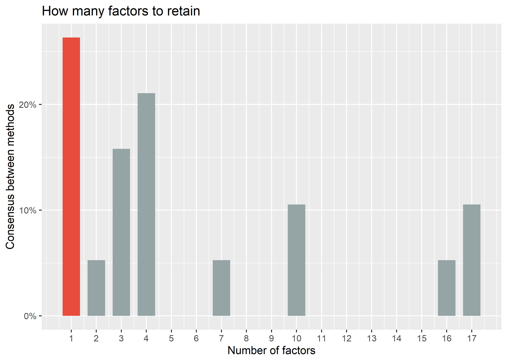
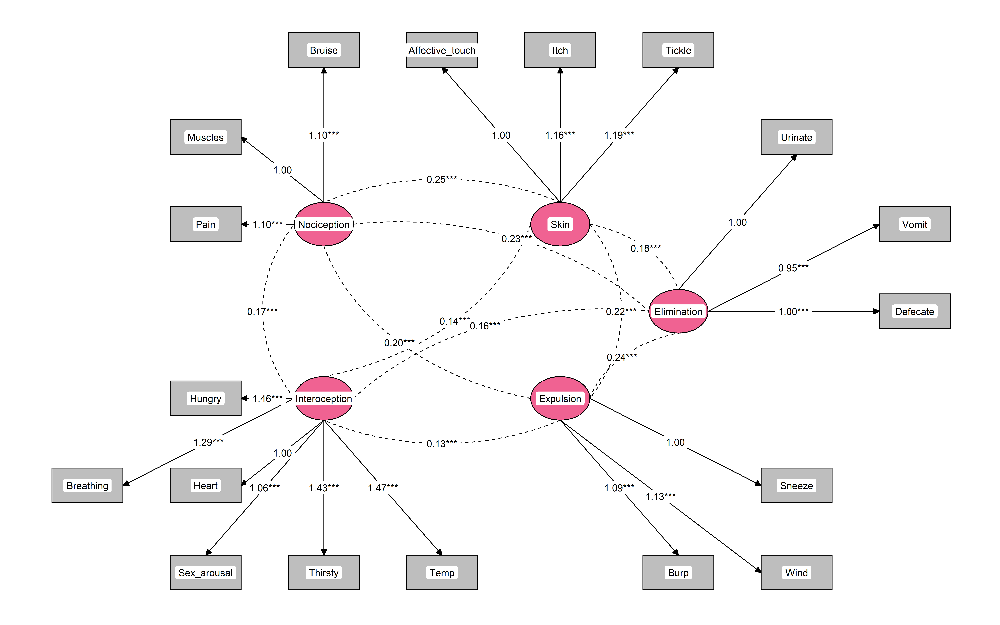

# Interoceptive Accuracy Scale Revised (IAS-R)

<sub>A reanalysis of Murphy, J., Brewer, R., Plans, D., Khalsa, S. S.,
Catmur, C., & Bird, G. (2020). [Testing the independence of
self-reported interoceptive accuracy and
attention](https://journals.sagepub.com/doi/full/10.1177/1747021819879826).
Quarterly Journal of Experimental Psychology, 73(1), 115-133.
<https://doi.org/10.31234/osf.io/fqgu4></sub>

We present a re-analysis of the data from [**Murphy et
al. (2020)**](https://journals.sagepub.com/doi/full/10.1177/1747021819879826)
(study 1) regarding the factor structure of the **Interoceptive Accuracy
Scale (IAS)**. In particular, we apply the *Method Agreement Procedure*
to estimate the optimal number of latent factors, and perform a further
model comparison using Confirmatory Factor Analysis (CFA).

Exploratory Factor Analysis suggested a 1-factor and 4-factors
solutions, but the latter was favoured by CFA. Further comparison
suggested that a 5-factors model (obtained by separating *Nociception*
from *Interoception*) had a superior fit. The 5 factors are:

-   **Interoception**: Heart, Hungry, Breathing, Thirsty, Temperature,
    Sexual arousal.
-   **Nociception**: Muscles, Bruise, Pain.
-   **Expulsion**: Burp, Sneeze, Wind.
-   **Elimination**: Vomit, Defecate, Urinate.
-   **Skin**: Itch, Tickle, Affective touch.

The final revised scale, made of 18 items (6 for interoception and 3 per
secondary dimension), is available [below](#IAS-R).

## Participants

``` r
library(tidyverse)
library(easystats)

df <- haven::read_sav("Study 1.sav") |> 
  mutate_all(as.numeric) |> 
  mutate(Gender = as.character(ifelse(Gender == 1, "Male", ifelse(Gender == 2, "Female", "Other"))))
  
paste0(
  "Data from the [study 1](https://osf.io/3m5nh/?view_only=a68051df4abe4ecb992f22dc8c17f769) (Murphy et al., 2020), downloaded from OSF, included ",
  report::report_participants(df, age = "Age", sex = NA, gender = "Gender"),
  "."
)
```

\[1\] “Data from the [study
1](https://osf.io/3m5nh/?view_only=a68051df4abe4ecb992f22dc8c17f769)
(Murphy et al., 2020), downloaded from OSF, included 451 participants
(Mean age = 25.8, SD = 8.4, range: \[18, 69\]; Gender: 69.4% women,
29.5% men, 1.11% non-binary).”

## EFA

``` r
data <- select(df, -Age, -Gender)

n <- parameters::n_factors(data)

n
# # Method Agreement Procedure:
# 
# The choice of 1 dimensions is supported by 5 (26.32%) methods out of 19 (Bentler, Acceleration factor, Scree (R2), VSS complexity 1, Velicer's MAP).
plot(n)
```

<!-- -->

The *Method Agreement Procedure* suggested that 1 factor was optimal,
followed by 4 factors.

``` r
efa1 <- parameters::factor_analysis(data, n=1, sort = TRUE)
efa1
# # Loadings from Factor Analysis (no rotation)
# 
# Variable        | MR1  | Complexity | Uniqueness
# ------------------------------------------------
# Pain            | 0.60 |    1.00    |    0.64   
# Sneeze          | 0.59 |    1.00    |    0.65   
# Temp            | 0.57 |    1.00    |    0.67   
# Wind            | 0.57 |    1.00    |    0.68   
# Affective_touch | 0.56 |    1.00    |    0.69   
# Muscles         | 0.55 |    1.00    |    0.69   
# Tickle          | 0.54 |    1.00    |    0.70   
# Itch            | 0.54 |    1.00    |    0.71   
# Defecate        | 0.54 |    1.00    |    0.71   
# Vomit           | 0.54 |    1.00    |    0.71   
# Taste           | 0.53 |    1.00    |    0.72   
# Cough           | 0.53 |    1.00    |    0.72   
# Bruise          | 0.52 |    1.00    |    0.73   
# Burp            | 0.52 |    1.00    |    0.73   
# Urinate         | 0.50 |    1.00    |    0.75   
# Breathing       | 0.50 |    1.00    |    0.75   
# Thirsty         | 0.44 |    1.00    |    0.81   
# Sex_arousal     | 0.41 |    1.00    |    0.83   
# Hungry          | 0.41 |    1.00    |    0.84   
# Heart           | 0.39 |    1.00    |    0.85   
# Blood_Sugar     | 0.38 |    1.00    |    0.86   
# 
# The unique latent factor accounted for 26.51% of the total variance of the original data.

efa4 <- parameters::factor_analysis(data, n=4, rotation = "oblimin", sort = TRUE)
efa4
# # Rotated loadings from Factor Analysis (oblimin-rotation)
# 
# Variable        |    MR2    |  MR3  |    MR1    |    MR4    | Complexity | Uniqueness
# -------------------------------------------------------------------------------------
# Tickle          |   0.72    | 0.03  |   -0.10   |   0.11    |    1.09    |    0.47   
# Itch            |   0.67    | 0.14  | -9.44e-03 |   -0.10   |    1.13    |    0.46   
# Affective_touch |   0.49    | -0.13 |   0.29    |   0.13    |    1.97    |    0.59   
# Blood_Sugar     |   0.29    | 0.21  |   0.18    |   -0.23   |    3.51    |    0.75   
# Burp            |   -0.03   | 0.73  |   -0.03   | -1.21e-03 |    1.00    |    0.50   
# Cough           | 7.56e-03  | 0.69  | 7.00e-03  |   -0.01   |    1.00    |    0.52   
# Sneeze          |   0.07    | 0.54  | 7.09e-03  |   0.20    |    1.30    |    0.55   
# Wind            |   0.08    | 0.46  |   0.07    |   0.16    |    1.37    |    0.62   
# Hungry          |   -0.16   | 0.04  |   0.65    |   0.03    |    1.13    |    0.60   
# Thirsty         | -4.84e-03 | 0.01  |   0.49    |   0.11    |    1.11    |    0.70   
# Breathing       |   0.14    | 0.05  |   0.44    |   0.03    |    1.24    |    0.70   
# Heart           |   0.11    | -0.07 |   0.40    |   0.08    |    1.32    |    0.78   
# Bruise          |   0.31    | 0.25  |   0.34    |   -0.25   |    3.74    |    0.59   
# Pain            |   0.29    | 0.01  |   0.32    |   0.20    |    2.67    |    0.61   
# Temp            |   0.19    | 0.13  |   0.29    |   0.16    |    2.91    |    0.67   
# Muscles         |   0.20    | 0.13  |   0.26    |   0.16    |    3.24    |    0.69   
# Sex_arousal     |   0.18    | 0.02  |   0.21    |   0.15    |    2.81    |    0.82   
# Defecate        |   0.10    | 0.11  | 2.77e-03  |   0.66    |    1.10    |    0.46   
# Urinate         |   -0.11   | 0.13  |   0.24    |   0.52    |    1.65    |    0.54   
# Taste           |   0.23    | 0.06  |   0.17    |   0.30    |    2.60    |    0.69   
# Vomit           |   0.21    | 0.18  |   0.11    |   0.25    |    3.26    |    0.71   
# 
# The 4 latent factors (oblimin rotation) accounted for 37.94% of the total variance of the original data (MR2 = 10.46%, MR3 = 10.17%, MR1 = 10.08%, MR4 = 7.23%).
```

## CFA

``` r
library(lavaan)

cfa1 <- lavaan::cfa(parameters::efa_to_cfa(efa1, 
                                           names="IAS"), data=data)
cfa4 <- lavaan::cfa(parameters::efa_to_cfa(efa4, 
                                           names=c("Skin", "Expulsion", "Interoception", "Elimination"),
                                           threshold = "max"), data=data)


anova(cfa1, cfa4)
# Chi-Squared Difference Test
# 
#       Df   AIC   BIC Chisq Chisq diff Df diff Pr(>Chisq)    
# cfa4 183 23648 23846   545                                  
# cfa1 189 23868 24041   777        232       6     <2e-16 ***
# ---
# Signif. codes:  0 '***' 0.001 '**' 0.01 '*' 0.05 '.' 0.1 ' ' 1
```

The 4-factors model suggested by EFA presented a significantly better
fit than the 1-factor model. We then compared that model to two
variants: one with 2 items removed (Blood sugar and Taste), and another
with, additionally, the *Interoception* factor split into two (with the
pain-related items grouped together). The latter model (*CFA-5*), was
significantly superior to the others. Additionally, we removed the least
loaded items of expulsion (cough) to improve the balance (3 items per
secondary scales, and 6 for interoception), which significantly improved
the model fit.

``` r
cfa4mod <- "
Skin =~ Affective_touch + Tickle + Itch
Expulsion =~ Sneeze + Cough + Wind + Burp
Interoception =~ Heart + Hungry + Breathing + Thirsty + Temp + Sex_arousal + Muscles + Bruise + Pain
Elimination =~ Urinate + Defecate + Vomit
" |> 
lavaan::cfa(data=data)

cfa5 <- "
Skin =~ Affective_touch + Tickle + Itch
Expulsion =~ Sneeze + Cough + Wind + Burp
Interoception =~ Heart + Hungry + Breathing + Thirsty + Temp + Sex_arousal
Nociception =~ Muscles + Bruise + Pain
Elimination =~ Urinate + Defecate + Vomit
" |> 
lavaan::cfa(data=data)

anova(cfa4, cfa4mod, cfa5)
# Chi-Squared Difference Test
# 
#          Df   AIC   BIC Chisq Chisq diff Df diff Pr(>Chisq)    
# cfa5    142 21353 21551   441                                  
# cfa4mod 146 21374 21555   469       28.8       4    8.4e-06 ***
# cfa4    183 23648 23846   545       75.6      37    0.00019 ***
# ---
# Signif. codes:  0 '***' 0.001 '**' 0.01 '*' 0.05 '.' 0.1 ' ' 1
```

``` r
cfa5mod <- "
Skin =~ Affective_touch + Tickle + Itch
Expulsion =~ Sneeze + Wind + Burp
Interoception =~ Heart + Hungry + Breathing + Thirsty + Temp + Sex_arousal
Nociception =~ Muscles + Bruise + Pain
Elimination =~ Urinate + Defecate + Vomit
" |> 
lavaan::cfa(data=data)

anova(cfa5, cfa5mod)
# Chi-Squared Difference Test
# 
#          Df   AIC   BIC Chisq Chisq diff Df diff Pr(>Chisq)    
# cfa5mod 125 20363 20552   379                                  
# cfa5    142 21353 21551   441       61.4      17    6.1e-07 ***
# ---
# Signif. codes:  0 '***' 0.001 '**' 0.01 '*' 0.05 '.' 0.1 ' ' 1
```

## New sample

``` r
df2 <- haven::read_sav("Study 6 IAS.sav") |> 
  mutate_all(as.numeric) |> 
  mutate(Gender = as.character(ifelse(Gender == 1, "Male", ifelse(Gender == 2, "Female", "Other"))))
  
paste0(
  "Data from the [study 6](https://osf.io/3m5nh/?view_only=a68051df4abe4ecb992f22dc8c17f769) (Murphy et al., 2020), downloaded from OSF, included ",
  report::report_participants(df2, age = "Age", sex = NA, gender = "Gender"),
  "."
)
```

\[1\] “Data from the [study
6](https://osf.io/3m5nh/?view_only=a68051df4abe4ecb992f22dc8c17f769)
(Murphy et al., 2020), downloaded from OSF, included 375 participants
(Mean age = 35.3, SD = 16.9, range: \[18, 91\]; Gender: 70.1% women,
28.5% men, 1.33% non-binary).”

``` r
cfa5mod_refit <- update(cfa5mod, data=df2)
cfa5_refit <- update(cfa5, data=df2)
cfa4mod_refit <- update(cfa4mod, data=df2)

anova(cfa5mod_refit, cfa5_refit, cfa4mod_refit)
# Chi-Squared Difference Test
# 
#                Df   AIC   BIC Chisq Chisq diff Df diff Pr(>Chisq)    
# cfa5mod_refit 125 16205 16386   339                                  
# cfa5_refit    142 17051 17240   412       72.8      17    7.2e-09 ***
# cfa4mod_refit 146 17076 17248   444       32.1       4    1.8e-06 ***
# ---
# Signif. codes:  0 '***' 0.001 '**' 0.01 '*' 0.05 '.' 0.1 ' ' 1
```

## Final Model

``` r
final <- update(cfa5mod, data = datawizard::data_merge(df, df2, join="bind"))
```

``` r
library(tidySEM)


graph_data <- tidySEM::prepare_graph(cfa5mod, 
                   layout=get_layout(cfa5mod, layout_algorithm = "layout_nicely"), 
                   variance_diameter=NA) 

nodes(graph_data) <- nodes(graph_data) |> 
  mutate(fill = ifelse(shape == "rect", "grey", "#F06292"))


plot(graph_data)
```

<!-- -->

``` r
performance::performance(cfa5mod) |> 
  display()
```

| Chi2(125) | p (Chi2) | Baseline(153) | p (Baseline) | GFI  | AGFI | NFI  | NNFI | CFI  | RMSEA |    RMSEA CI    | p (RMSEA) | RMR  | SRMR | RFI  | PNFI | IFI  | RNI  | Loglikelihood |   AIC    |   BIC    | BIC_adjusted |
|:----------|:--------:|:-------------:|:------------:|:----:|:----:|:----:|:----:|:----:|:-----:|:--------------:|:---------:|:----:|:----:|:----:|:----:|:----:|:----:|:-------------:|:--------:|:--------:|:------------:|
| 379.08    | \< .001  |    2234.49    |   \< .001    | 0.91 | 0.88 | 0.83 | 0.85 | 0.88 | 0.07  | \[0.06, 0.07\] |  \< .001  | 0.05 | 0.06 | 0.79 | 0.68 | 0.88 | 0.88 |   -10135.67   | 20363.34 | 20552.47 |   20406.48   |

``` r
parameters::parameters(cfa5mod) |> 
  display()
```

| Link                          | Coefficient |  SE  |    95% CI    |   z   |    p    |
|:------------------------------|:-----------:|:----:|:------------:|:-----:|:-------:|
| Skin =\~ Affective_touch      |    1.00     | 0.00 | (1.00, 1.00) |       | \< .001 |
| Skin =\~ Tickle               |    1.19     | 0.11 | (0.97, 1.41) | 10.57 | \< .001 |
| Skin =\~ Itch                 |    1.16     | 0.11 | (0.94, 1.38) | 10.40 | \< .001 |
| Expulsion =\~ Sneeze          |    1.00     | 0.00 | (1.00, 1.00) |       | \< .001 |
| Expulsion =\~ Wind            |    1.13     | 0.11 | (0.92, 1.35) | 10.38 | \< .001 |
| Expulsion =\~ Burp            |    1.09     | 0.11 | (0.88, 1.30) | 10.22 | \< .001 |
| Interoception =\~ Heart       |    1.00     | 0.00 | (1.00, 1.00) |       | \< .001 |
| Interoception =\~ Hungry      |    1.46     | 0.20 | (1.06, 1.86) | 7.16  | \< .001 |
| Interoception =\~ Breathing   |    1.29     | 0.17 | (0.96, 1.62) | 7.60  | \< .001 |
| Interoception =\~ Thirsty     |    1.43     | 0.20 | (1.04, 1.81) | 7.27  | \< .001 |
| Interoception =\~ Temp        |    1.47     | 0.19 | (1.10, 1.84) | 7.80  | \< .001 |
| Interoception =\~ Sex_arousal |    1.06     | 0.16 | (0.74, 1.38) | 6.48  | \< .001 |
| Nociception =\~ Muscles       |    1.00     | 0.00 | (1.00, 1.00) |       | \< .001 |
| Nociception =\~ Bruise        |    1.10     | 0.12 | (0.86, 1.34) | 9.02  | \< .001 |
| Nociception =\~ Pain          |    1.10     | 0.10 | (0.89, 1.30) | 10.66 | \< .001 |
| Elimination =\~ Urinate       |    1.00     | 0.00 | (1.00, 1.00) |       | \< .001 |
| Elimination =\~ Defecate      |    1.00     | 0.10 | (0.81, 1.19) | 10.43 | \< .001 |
| Elimination =\~ Vomit         |    0.95     | 0.11 | (0.75, 1.16) | 9.05  | \< .001 |

\# Loading

| Link                           | Coefficient |  SE  |    95% CI    |  z   |    p    |
|:-------------------------------|:-----------:|:----:|:------------:|:----:|:-------:|
| Skin \~\~ Expulsion            |    0.22     | 0.03 | (0.16, 0.29) | 6.85 | \< .001 |
| Skin \~\~ Interoception        |    0.14     | 0.02 | (0.09, 0.18) | 5.89 | \< .001 |
| Skin \~\~ Nociception          |    0.25     | 0.03 | (0.18, 0.31) | 7.24 | \< .001 |
| Skin \~\~ Elimination          |    0.18     | 0.03 | (0.12, 0.24) | 6.06 | \< .001 |
| Expulsion \~\~ Interoception   |    0.13     | 0.02 | (0.09, 0.18) | 6.11 | \< .001 |
| Expulsion \~\~ Nociception     |    0.20     | 0.03 | (0.14, 0.26) | 6.95 | \< .001 |
| Expulsion \~\~ Elimination     |    0.24     | 0.03 | (0.17, 0.30) | 7.47 | \< .001 |
| Interoception \~\~ Nociception |    0.17     | 0.02 | (0.12, 0.21) | 6.66 | \< .001 |
| Interoception \~\~ Elimination |    0.16     | 0.02 | (0.12, 0.21) | 6.59 | \< .001 |
| Nociception \~\~ Elimination   |    0.23     | 0.03 | (0.17, 0.29) | 7.44 | \< .001 |

\# Correlation

## IAS-R

**Instructions**. Below are several statements regarding how accurately
you can perceive specific bodily sensations. Please rate on the scale
how well you believe you can perceive each specific signal. For example,
if you often feel you need to urinate and then realise you do not need
to when you go to the toilet you would rate your accuracy perceiving
this bodily signal as low.

Please only rate how well you can perceive these signals without using
external cues, for example, if you can only perceive how fast your heart
is beating when you measure it by taking your pulse this would not count
as accurate internal perception.

**Scale**. Disagree - Agree.

1.  ***(Interoception)*** I can always accurately perceive when my heart
    is beating fast
2.  ***(Interoception)*** I can always accurately perceive when I am
    hungry
3.  ***(Interoception)*** I can always accurately perceive when I am
    breathing fast
4.  ***(Interoception)*** I can always accurately perceive when I am
    thirsty
5.  ***(Interoception)*** I can always accurately perceive when I am
    hot/cold
6.  ***(Interoception)*** I can always accurately perceive when I am
    sexually aroused
7.  ***(Elimination)*** I can always accurately perceive when I need to
    urinate
8.  ***(Elimination)*** I can always accurately perceive when I need to
    defecate
9.  ***(Elimination)*** I can always accurately perceive when I am going
    to vomit
10. ***(Expulsion)*** I can always accurately perceive when I am going
    to pass wind
11. ***(Expulsion)*** I can always accurately perceive when I am going
    to burp
12. ***(Expulsion)*** I can always accurately perceive when I am going
    to sneeze
13. ***(Nociception)*** I can always accurately perceive when my muscles
    are tired/sore
14. ***(Nociception)*** I can always accurately perceive when I am going
    to get a bruise
15. ***(Nociception)*** I can always accurately perceive when I am in
    pain
16. ***(Skin)*** I can always accurately perceive when someone is
    touching me affectionately rather than non-affectionately
17. ***(Skin)*** I can always accurately perceive when something is
    going to be ticklish
18. ***(Skin)*** I can always accurately perceive when something is
    going to be itchy
