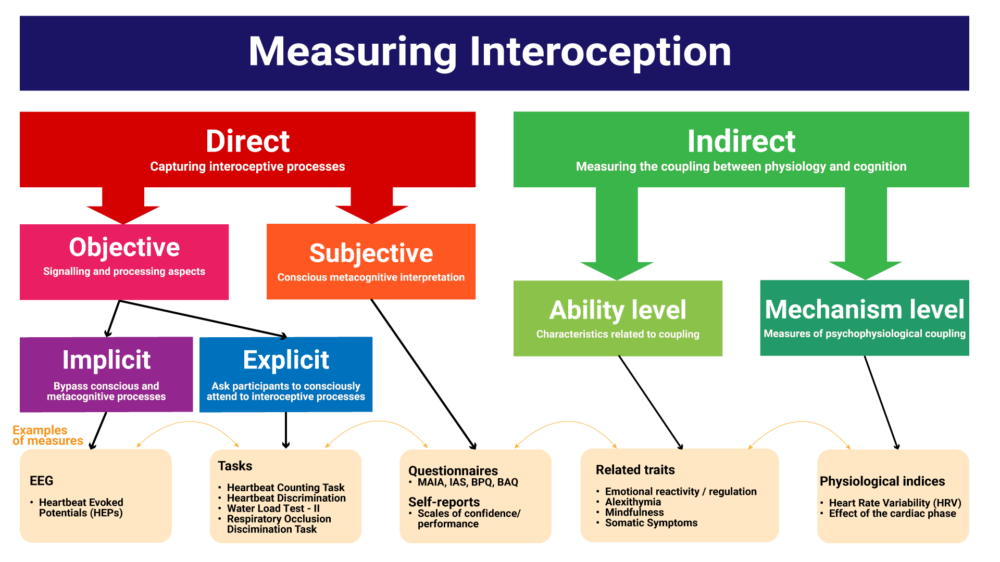
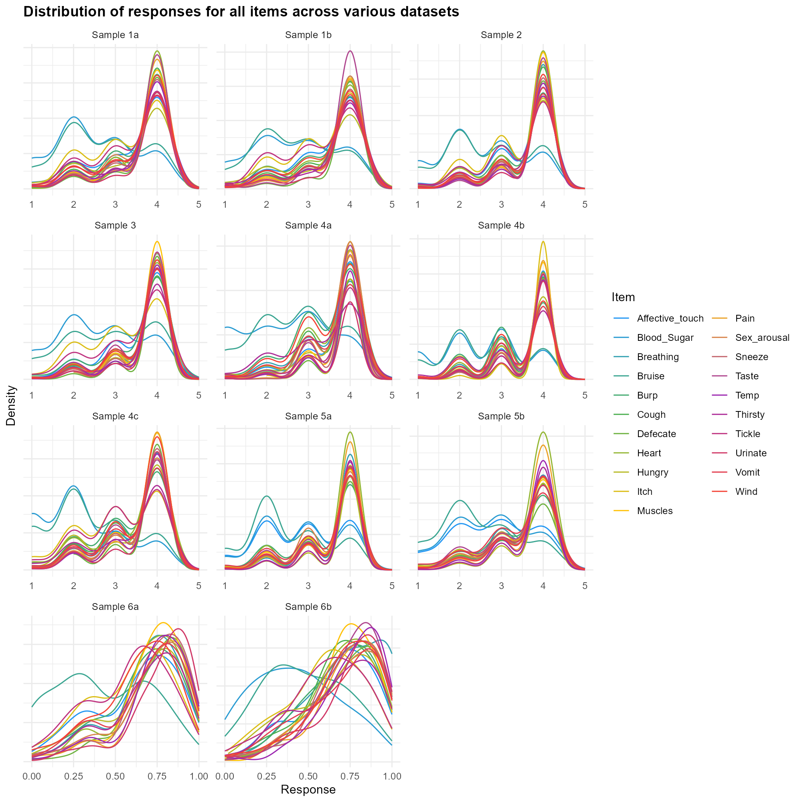
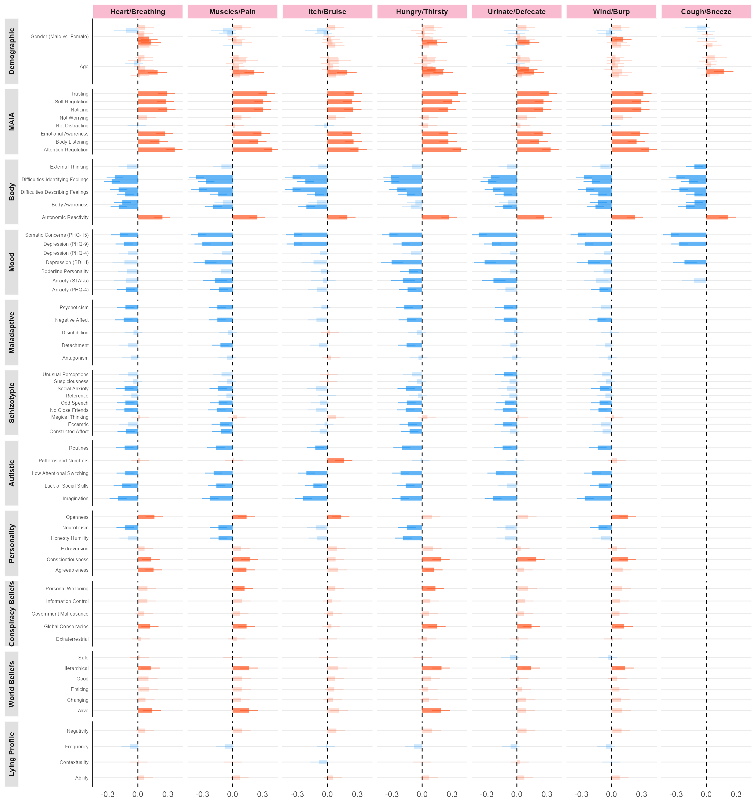
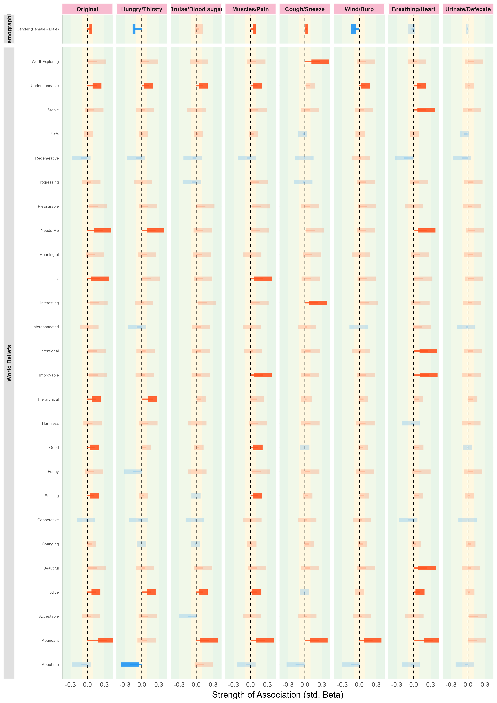

# Introduction

<!-- Interoception definition -->

Interoception refers to sensing, interpreting and integrating information of internal bodily stimuli by the nervous system, including organs (e.g., heart, lungs, gut) and broader physiological tissues, to convey the body's current state [@khalsa2018interoception]. Despite its recognised role in emotion recognition [@terasawa2021effects] and regulation [@zamariola2019relationship], decision making [@pollatos2023interoceptive], learning [@joshi2023interoception], body-ownership [@raimo2021body], physical [@harrison2024interoception] and psychological health [@nord2021disrupted], and well-being [@ferentzi2019body], the field remains hampered by concerns over its conceptualization and measurement [@desmedt2025discrepancies; @desmedt2022measures; @murphy2024interoception]. 

## The Interoceptive Assessment Puzzle

<!-- Interoception measure -->

Given interoception's centrality to brain function, many measures could be seen as "indirectly" assessing it — including indices quantifying coupling between physiological signals and cognitive or behavioural processes (e.g., Heart Rate Variability), or constructs theoretically dependent on interoceptive information (e.g., alexithymia). Critically, various *direct* measures have also been developed (see @fig-measures), spanning "objective" and "subjective" assessments (e.g., heartbeat counting/tracking tasks *vs.* questionnaires and scales), "explicit" and "implicit" paradigms (i.e., directing *vs.* covertly measuring attention to interoceptive processes), multiple modalities (e.g., cardioception, respiroception, gastroception), and theoretical dimensions (e.g., accuracy, sensitivity, awareness).
<!-- While there is no consensus as to which particular approach provides the most accurate and "pure" measure of interoception and interoceptive abilities (assuming it is a unidimensional construct), it is instead plausible that each measure has strengths and limitations, and a utility dependent on the context and goal at hand [@jahedi2014; @Desmedt2023accuracy]. -->
The diversity of measures reflects the absence of a "gold-standard" for interoception, with each having strengths and limitations depending on the research context and dimension assessed [@jahedi2014; @Desmedt2023accuracy].

```{r}
#| warning: false
#| label: "fig-measures"
#| apa-twocolumn: true  # A Figure Spanning Two Columns When in Journal Mode
#| out-width: "100%"
#| fig-cap: "Schematic Representation of The Interoceptive Assessment Puzzle. The different modalities of interoception (e.g., cardioception) can be assessed directly or indirectly. Direct assessments can be subjective or objective, depending on whether they use conscious metacognitive appraisals or performance-based indices. Objective interoceptive tasks can be explicit (participants must consciously attend to interoceptive signals; e.g., the heartbeat counting task) or implicit (measurements of interoception are covert; e.g., heartbeat evoked potentials measured during rest). Indirect assessments evaluate constructs typically related, or dependent on, interoceptive processes (e.g., physiological indices such as heart rate variability or effect of cardiac phase) or abilities (e.g., self-report measures of emotion regulation or identification abilities)."


```

## Self-reported Interoception

<!-- self-reports -->
Although using self-report questionnaires to measure deeply embodied functions might seem paradoxical, recent redefinitions of interoception emphasize the importance of metacognitive elaboration of interoceptive information, supporting the idea that some facets such as metacognitive beliefs, can be assessed subjectively [@khalsa2018interoception; @suksasilp2022towards].
The notion that self-reported interoception reflects a fundamentally different aspect of conscious interoceptive processing than objective task measures is thought to be central to understanding the reported lack of convergence between objective and subjective measures [@desmedt2022measures]. For instance, questionnaires and objective measures [HCT, @schandry1981heart; Heartbeat Detection Task (HDT), @kleckner2015methodological] show weak or no correlations, even when intended to capture the same theoretical interoceptive dimension [e.g., task-based accuracy vs. self-reported accuracy, @murphy2019; @brand2023; @arslanova2022].

Lack of convergence also exists within objective or subjective measures purporting to assess the same dimension: task-based accuracy measures show weak or no intercorrelations [@brand2023; @hickman2020relationship], and subjective accuracy scores similarly yield weaker than expected relationships [@vig2022questionnaires]. Beyond validity concerns, this suggests that even within a measurement domain, different measures may target fundamentally different facets of interoception, undermining replicability and hindering theoretical and empirical progress.

One striking example concerns the assessment of interoceptive sensibility - the self-reported tendency to focus on (with or without correctly detecting) internal sensations [@garfinkel2015knowing; @khalsa2018interoception].
A recent systematic review suggested that questionnaires designed to assess interoceptive sensibility may in fact measure distinct constructs, with researchers often treating them as equivalent despite low overall convergence [@desmedt2022measures].
The review included popular measures, such as the Body Perception Questionnaire [BPQ, @porges1993body], the Multidimensional Assessment of Interoceptive Awareness [MAIA, @mehling2012; MAIA-2, @mehling2018multidimensional], the Body Awareness Questionnaire [BAQ, @shields1989body], the Private subscale of the Body Consciousness Questionnaire [PBCS, @miller1981consciousness], and the Self-Awareness Questionnaire [SAQ, @longarzo2015self] which comprised 86% of all citations. Their low-to-moderate intercorrelations suggest they capture different aspects of interoception rather than a common construct, emphasizing the need for conceptual clarity regarding what each measures, how they relate to different interoception dimensions, and their overlap with constructs such as alexithymia and body awareness. One avenue for addressing these issues is the investigation of newer measures not included in prior reviews.

## The Interoceptive Accuracy Scale (IAS)

<!-- Introducing the IAS -->

Focusing on self-perceived *accuracy*, the Interoceptive Accuracy Scale [IAS, @murphy2019] is a recently developed measure with rapidly growing popularity. The IAS was designed to clarify both what and how interoception is measured, by treating interoceptive accuracy and attention as distinct dimensions — whereas many existing models conflate them [e.g., @garfinkel2015knowing; @khalsa2018interoception]. Individuals may thus report attending to bodily signals while recognising their perception of those signals is inaccurate. This distinction positions the IAS as the only tool specifically designed to assess subjective interoceptive accuracy, marking a conceptual advance in interoceptive measurement.

The IAS comprises 21 Likert-scale items assessing perceived accuracy across physiological modalities, one item per modality such as respiration (*"I can always accurately perceive when I am breathing fast"*), heart (*"I can always accurately perceive when my heart is beating fast"*), skin (*"I can always accurately perceive when something is going to be ticklish"*), arousal or bodily functions like coughing (*"I can always accurately perceive when I am going to cough"*) or urinating (*"I can always accurately perceive when I need to urinate"*). Its items capture specific interoceptive behaviors and "objective" experiences (albeit subjectively reported), a notable distinction from other popular questionnaires, such as the MAIA-2, which includes broader metacognitive items (e.g., *"I trust my body sensations"*, *"I can notice an unpleasant body sensation without worrying about it"*), and dimensions related to attention and emotion regulation (e.g., Not-distracting and Not-worrying subscales respectively).

<!-- IAS structure  -->
The original IAS validation study suggested a two-factor structure: one reflecting the perception of interoceptive signals (urinate, hungry, defecate, thirsty, pain, heart, taste, breathing, temperature, muscles, affective touch, vomit, sexual arousal), and another comprising signals difficult to perceive through interoception alone or reflecting socially unacceptable functions (itch, tickle, cough, burp, bruise, blood sugar, sneeze, wind). The authors highlight the imperfect fit of this solution [@murphy2019, p. 127], with subsequent studies identifying different optimal structures. Specifically, @brand2023 reported a 1-factor solution as best fit, whereas @lin2023 and @campos2021 found bifactor solutions [i.e., one general factor above lower-level factors, @rodriguez2016evaluating]. Using Exploratory Factor Analysis (EFA), and constraining the solution to two factors, @koike2023 identified a different 2-factor structure distinguishing cutaneous (e.g., itching, tickling, affective touch, muscle sensations) from visceral sensations (e.g., hunger, thirst, heartbeat, breathing).

Beyond factor structure, discussion has also concerned the specificity of individual IAS items. For instance, @murphy2019 note that while some items measure direct interoceptive signals (e.g., cardioception), others capture phenomena detectable through non-interoceptive means (e.g., "bruising" via skin discoloration; p. 119). @lin2023 identify several psychometric limitations, including five locally dependent item pairs and three items (touch, blood sugar, bruise) with high difficulty and low discrimination, suggesting further refinement is needed. Localisation issues also arose, with "itch" and "tickle" mapping to the same Chinese character and thus collapsed into a single item [@lin2023]. @campos2021 further suggested the IAS is predominantly unidimensional, with all items except "tickle" reflecting a general factor.

<!-- Relationship with other interoception measures -->

Regarding validity, the IAS shows positive correlations with most MAIA facets [@mehling2018multidimensional; @gaggero2021], except the Not-Distracting and Not-Worrying subscales [@brand2023] — previously linked to non-interoceptive abilities [@ferentzi2021examining]. Comparisons with the BPQ body awareness dimension have been mixed, with studies reporting small positive [@brand2023; @koike2023; @gaggero2021], small negative [@lin2023], quadratic positive [@campos2021], or no correlations [@murphy2019]. Positive correlations have been observed for four of five FFMQ subscales [@baer2006using; @brand2023; @koike2023], the EDI interoceptive awareness subscale [EDI-IA, @lin2023], and negative correlations with the Interoceptive Confusion Questionnaire [ICQ, @brewer2016alexithymia; @brand2023; @murphy2019]. Finally, the IAS' typically small correlation with the Interoceptive Attention Scale [IATS, @gabriele2022dissociations; @lin2023; @koike2023] supports the distinction between interoceptive accuracy and attention.

<!-- Convergent validity (correlates)  -->
Despite the theoretical challenges of assessing predictive validity, the IAS shows consistent negative associations with alexithymia [@brand2023; @koike2023; @campos2021; @murphy2019; @lin2023], somatic [@brand2023; @koike2023; @lin2023] and depressive symptoms [@brand2023; @koike2023; @lin2023], anxiety [@brand2023], neuroticism [@brand2023], and self-esteem [@murphy2019]. 

Together, these findings support the IAS as measuring an adaptive aspect of interoception, though its overlap with other interoception-related questionnaires across theoretical dimensions further highlights limitations of strictly orthogonal interoceptive models. While the IAS shows promise, further refinement is needed; something the present paper seeks to address with two aims.


<!-- current study -->
Given increasing interest in interoception across psychology and neuroscience, and the growing use of the IAS, careful scrutiny of this measure is warranted. Therefore, the current study has two aims. Study 1 aims to clarify the IAS' factor structure using a mega-analytic approach, aggregating existing raw datasets to contrast traditional CFA/SEM and Hierarchical Clustering Analysis (HCA) with network-based approaches [Exploratory Graph Analysis, EGA]. By triangulating results across samples and conceptually distinct analytical frameworks, we aim to provide a method-independent view of IAS structure, identifying both convergent and potentially overlooked features. Study 2 provides an overview of construct validity and dispositional correlates of the IAS, clarifying its associations with interoception-related constructs, mood, psychopathological and neurodevelopmental traits, and other relevant measures, situating interoceptive questionnaires within a broader context.


# Study 1

Study 1 re-analyses the factor structure of the IAS using raw data across 17 open-access datasets [@brand2023; @campos2021; @lin2023; @murphy2019; @arslanova2022; @todd2022; @gaggero2021; @brand2022; @von2023; @poerio2024interoceptive; @petzke2024somatic]. Combining studies yelds a more robust and generalizable understanding of the IAS' factor structure. However, as studies differ in sample size, demographic characteristics, language, and procedure, we also analyse each sample individually to add nuance to the general picture.

## Methods

### Datasets

We searched papers citing the original IAS validation paper [@murphy2019], identifying 136 (as of 01/05/2024). Inclusion required open-access raw data with individual IAS item scores; datasets shared directly by authors were also included. Consequently, 17 datasets were used, including five from unpublished studies (see **Table 1**), totaling 33,526 participants (Mean = 47.96 $\pm$ 13.1, 71.3\% Female).

<!-- Note: this table is generated during data analysis -->

<!-- \begin{landscape} -->

<!-- \input{../../analysis/figures/table1.tex} -->

<!-- \end{landscape} -->

```{r}
#| label: tbl-table1
#| tbl-cap: "Description of the samples used in Study 1 mega-analysis."
#| apa-note: "*Information taken from the sample description of relevant paper rather than recomputed. Samples using analogue scales were rescaled from a 0–1 range to a 1–5 scale to ensure comparability with the other samples."
#| apa-twocolumn: true
#| error: false
#| warning: false

library(flextable)
set_flextable_defaults(font.size = 6)

table <- readRDS("../../analysis/figures/table1.rds")

table |>
    dplyr::rename("Age (Mean  ± SD)" = Age, "Female %" = Female_Percentage) |>
    flextable() |>
    set_table_properties(
        layout = "autofit",
        opts_pdf = list(arraystretch = 1)
    ) |>
    theme_apa()
```

### Data Analysis

Psychometrically sound items should exhibit validity, reliability, and discrimination. Items where responses clustered narrowly around one option were flagged as potentially problematic, as this limits inter-individual variability.

<!-- UVA -->
We then tested for "redundant" items (e.g., due to multicollinearity or local dependency) using Unique Variable Analysis [UVA, @christensen2023unique], a network psychometrics method that identifies and merge items sharing substantial variance (which can distort the structure estimation). We applied a conservative threshold of 0.30, detecting "large" to "very large" item overlap, and only suggest scale modifications if strongly justified. 

Finally, the IAS factor structure was analysed using three complementary approaches: traditional exploratory and confirmatory Factor Analysis (EFA/CFA), hierarchical clustering (HCA), and Exploratory Graph Analysis (EGA). We applied them to both the combined sample and each dataset separately (full details at [https://github.com/RealityBending/InteroceptionIAS](https://github.com/RealityBending/InteroceptionIAS)) and conclusions draw on both overall and dataset-specific results.
<!-- EGA -->

EGA combines network analysis with psychometric methods [@golino2017exploratory] to jointly estimate the number of dimensions (i.e., groups of items) and structure stability of a scale [@golino2017exploratory; @golino2020investigating]. EGA is considered a suitable alternative to traditional factor analysis, addressing several of its limitations, including the "latent" source of variability assumption and sample-size-dependent bias in factor retention [@christensen2021equivalency]. EGA also outperforms methods like the Kaiser criterion and parallel analysis in estimating factor number in complex structures such as bi-factor solutions [@jimenez2023dimensionality]. At a fundamental level, EGA conceptualizes items as nodes in a network, with connections (edges) between nodes reflecting associations between items. Clustering of nodes reveals distinct communities of related items, in practice akin to traditional latent factors albeit without explicitly assuming their presence [@christensen2021equivalency]. We used the EGAnet package [@christensen2021estimating] to fit a hierarchical EGA with the Leiden community detection algorithm.

<!-- Factor Analysis -->
Although EGA is a robust alternative, factor analysis remains widely used for dimensionality assessmentand is included here for continuity with past literature. Unlike EGA, factor analysis assumes a latent source of variability (i.e., a common latent variable) underlying the observed variables [@cosemans2022exploratory]. A critical step is determining the optimal number of factors, for which we used the Method Agreement Procedure [@ludecke2021performance], a consensus-based decision method approach applying multiple estimation methods concurrently.

<!-- HCA -->

We also applied HCA [@murtagh2014ward], which unlike factor analysis assumes no latent structure, but instead iteratively groups items based on their similarity (e.g., correlation) into a hierarchy of clusters, offering interpretability without strict distributional assumptions.

<!-- CFA -->
In a typical 2-step fashion, initial analyses were followed by refinement via item selection (e.g., removing items with low stability, weak associations with other items, low reliability, or high cross-loadings), with the final item pool re-tested. Additionally, various solutions (e.g., adding general factors) were compared using Confirmatory Factor Analysis (CFA). Of note, datasets with missing items were excluded from analyses requiring the complete set of scale items.

## Results

<!-- Distributions of items -->

Item distributions were consistent across samples (@fig-distributions, top panel), with most participants responding 4/5 (agree) on all IAS items except "blood sugar" and "bruise", which showed a lower mode (~2/5).

While not problematic per se, this contrast may reflect non-homogeneous psychometric "difficulty", possibly due to challenges in inferring and reporting these sensations. Lower modes were also observed for "affective touch" in Chinese-language samples, suggesting translation or cultural discrepancies [@sorokowska2021affective]. More generally, response spread was narrow — with few extreme values (1 and 5) and most responses clustering around 4 (assuming the IAS is implemented as a 5-point Likert scale following its validation), potentially limiting psychometric sensitivity. Samples using an analogue scale (samples 10, 11, 12 in @fig-distributions) showed greater spread and inter-individual variability, though a secondary mode at ~2 hints at potential participant clusters. The correlation matrix (@fig-distributions, bottom panel) reveals an overall positive pattern, with notably correlated pairs (e.g., Tickle-Itch, Urinate-Defecate, Pain-Wind, Hungry-Thirsty) and triplets (e.g., Vomit-Sneeze-Cough, Temperature-Muscles-Pain).


```{r}
#| warning: false
#| label: fig-distributions
#| apa-twocolumn: true  # A Figure Spanning Two Columns When in Journal Mode
#| out-width: "100%"
#| fig-cap: "Top: Distribution of responses across datasets reveals a consistent modal value, typically 4 or 5 (indicating agreement), except for ‘blood sugar' and ‘bruise' (dashed lines) and ‘affective touch' (dotted lines) in the Chinese validation sample, which have lower modes. Most responses cluster around middle values, with few extreme scores (1 and 5). Samples using an analogue scale (10a-10c in Table 1 but 10-12 below) show a more continuous distribution and increased interindividual variability. Bottom: The correlation matrix between all items shows an overall positive correlation pattern, with correlated item pairs (e.g., Wind-Burp) and triplets (e.g., Vomit-Sneeze-Cough)."


```


<!-- UVA -->
UVA flagged "itch" and "tickle" as strongly redundant; "tickle" was removed from further analyses given its redundancy and absence from some datasets due to translation issues. Additional pairs were flagged as moderately redundant ("wind"/"burp"; "urinate"/"defecate") or mildly redundant ("sneeze"/"cough"; "heart"/"breathing"; "hungry"/"thirsty"), consistently across most samples.


## Structure Exploration

<!-- Initial run -->
HCA consistently grouped item pairs and triplets across samples: "wind"/"burp", "sneeze"/"cough", "itch"/"bruise", "urinate"/"defecate", and "pain"/"muscles"/"temperature". EGA largely replicated this, with an additional cluster comprising "sexual arousal", "affective touch", "temperature", "pain", "muscles", and "taste". EFA suggested an optimal 3-factor solution: expulsion-related items ("burp", "wind", "cough", "sneeze", "vomit"), visceroceptive items ("heart", "breathing", "hungry", "thirsty", "urinate", "defecate"), and items not directly accessible via internal sensation alone ("bruise", "blood sugar"). Full results are available via the GitHub repository above.

<!-- We discarded: -->

<!-- Taste: Lone item + unstable -->
<!-- Affective_touch: Cross-loadings + unstable -->
<!-- Vomit: Less strongly associated -->
<!-- Itch: Less strongly associated, did not form consistent cluster -->
<!-- More controversial: Temp and Sex_arousal: similar cluster yet less reliable -->

Initial structural analyses flagged six further problematic items beyond "tickle": "taste" showed a lone or unstable association pattern; "affective touch" exhibited cross-loadings and instability; "vomit" was weakly associated with other items; "itch" formed no consistent cluster; and "temperature" and "sexual arousal" showed redundant but unreliable associations. These six items, alongside "tickle", were removed, and structural analyses were re-run on the remaining 14 items (see @fig-structure).

```{r}
#| warning: false
#| label: fig-structure
#| apa-twocolumn: true  # A Figure Spanning Two Columns When in Journal Mode
#| out-width: "100%"
#| fig-cap: "Four structure analysis methods (HCA, EGA, EFA, CFA) were applied and converged on a consistent optimal solution of 14 items formed seven pairs: Hungry-Thirsty, Bruise-Blood sugar, Urinate-Defecate, Muscles-Pain, Breathing-Heart, Cough-Sneeze, Wind-Burp. While EFA suggested 3 factors, CFA confirmed the superiority of the 7-factor model over alternative structures."


```


<!-- Second run -->
HCA and EGA yielded highly consistent results, identifying seven stable item pairs: Hungry-Thirsty, Bruise-Blood sugar, Urinate-Defecate, Muscles-Pain, Breathing-Heart, Cough-Sneeze, and Wind-Burp. HCA additionally grouped Urinate-Defecate with Muscles-Pain, and the two expulsion pairs (Wind-Burp, Cough-Sneeze) together. EFA again suggested a 3-factor solution: expulsion items ("burp", "wind", "cough", "sneeze"), the Urinate-Defecate pair, and the remaining items.

<!-- CFA Model Comparison
Name	BIC	RMSEA	Chi2	CFI	BF
fit_g	940941.8	0.124	27,398.095	0.783	Inf
fit_ega	1110166.4	0.035	2,334.112	0.984	NA
fit_egag	1114563.1	0.054	6,876.395	0.952	0
fit_hclust	1121159.8	0.078	13,441.878	0.906	0
fit_hclustg	1122347.5	0.079	14,681.532	0.897	0
fit_efag	1124348.4	0.083	16,703.253	0.883	0
fit_efa	1124348.4	0.083	16,703.253	0.883	0 -->


<!-- Samples where CFA converged
fit_ega	15870.94	0.026	72.825	0.988	NA - sample 1a
fit_ega	28320.01	0.025	83.537	0.991	NA - sample 4
fit_ega	20224.33	0.046	130.586	0.978	NA - sample 6
it_ega	17647.14	0.038	98.571	0.973	NA - sample 7a
fit_ega	68203.78	0.033	178.485	0.982	NA - sample 7b
fit_ega	23336.33	0.036	102.630	0.976	NA - sample 7c
fit_ega	40816.35	0.033	128.727	0.976	NA - sample 8a
fit_ega	18031.48	0.031	83.225	0.977	NA - sample 8b
it_ega	720615.2	0.041	2,068.422	0.980	NA - sample 9
fit_ega	29023.36	0.052	181.784	0.948	NA - sample 11
fit_ega	25899.23	0.038	116.734	0.977	NA - sample 13
fit_ega	3975.352	0.040	65.620	0.975	NA - sampple 14 
fit_ega	8493.471	0.057	102.289	0.947	NA - sample 17
-->

<!-- did not converge: df1b, df2, df3, df5, df10 (missing items), df12 (errors), df15 (errors), df16,  -->

## Confirmatory Factor Analysis (CFA)

<!-- CFA -->
We used CFA to fit and compare candidate structures from the previous analyses: a 1-factor (G-model), 3-factor (EFA), 3+1 (EFA + general factor), 5-factor (HCA), 5+1 (HCA + general factor), 7-factor (EGA), and 7+1 (EGA + general factor) model. The 7-factor EGA model provided the best fit (RMSEA = 0.035, χ2\chi^2
χ2 = 2,334.112, CFI = 0.984), followed by EGA + general factor (RMSEA = 0.054, χ2\chi^2
χ2 = 6,876.395, CFI = 0.952) and the 5-factor HCA model (RMSEA = 0.078, χ2\chi^2
χ2 = 13,441.878, CFI = 0.906). All remaining models performed poorly (RMSEA > 0.08, CFI < 0.90). The EGA model also yielded the lowest BIC; all other models showed substantially weaker evidence (BIC-based Bayes Factor < 1/100).

Across individual datasets, the 7-factor EGA model provided the best fit in 8 of 13 samples where CFA converged (RMSEA ≈ 0.025–0.057, CFI ≥ 0.95). Adding a general factor improved fit in three samples (RMSEA ≈ 0.048–0.061, CFI ≈ 0.929–0.957), and the 5-factor + general factor model was preferred in two (RMSEA = 0.049/0.057, CFI = 0.955/0.919). Bayes factor comparisons aligned with BIC-based conclusions. Overall, while the EGA model was preferred in most samples, bifactor models provided some evidence for a common IAS factor.


## Discussion

<!-- Aim and previous factor structures -->
Study 1 aimed to systematically evaluate the structure of the IAS using a mega-analytic approach with both factor-analytic and network-based methods. Previous research across different datasets has highlighted inconsistency in optimal factor structure [e.g., unidimensional, bifactor, and two factor solutions have all been reported @brand2023; @campos2021; @lin2023; @murphy2019; @koike2023] and raised concerns about specific items (e.g., low discrimination, local dependencies, and items reflecting phenomena less accessible to interoception). To address these concerns and inconsistencies we combined 17 datasets with over 33 thousand participants using the IAS, providing the most comprehensive and robust analysis of the IAS structure to date. We conducted analyses across both combined and individual datasets allowing an examination of overall and dataset specific results and how they compared across three different structural analyses methods (EFA, HCA, EGA). 

<!-- Item pairs and optimal structure -->
Analyses revealed that seven item pairs (Hungry-Thirsty, Bruise-Blood sugar, Urinate-Defecate, Muscles-Pain, Breathing-Heart, Cough-Sneeze, Wind-Burp) provided a robust and replicable structure, leading to a refined 14-item IAS. These seven pairs emerged consistently across datasets and had superior fit indices compared to alternative models for most samples. Results suggest that rather than measuring the broad latent construct of "interoceptive accuracy" the IAS reflects clusters of tightly coupled items tied to specific bodily sensations, including both "directly" felt sensations and inferred or anticipatory physical processes in the case of the Bruise-Blood Sugar pairing. Notably, while $\chi^2$ and BIC can be sensitive to very large sample sizes, the conclusions are supported not only by model fit but also by the replication of the structure across analytic approaches and individual datasets.

<!-- Implications for scale interpretation -->
Alternative mechanisms may also contribute to the emergence of these item pairings. Clustering may reflect shared temporal or functional characteristics of bodily events. For example, the Cough-Sneeze and Wind-Burp pairings may involve rapid reflexive responses and frequent experiential co-occurrence, whereas the Hungry-Thirsty and the Urinate-Defecate pairings may be shaped by basic homeostatic regulation and recurrent need states. Such shared characteristics may elicit similar response strategies even when the underlying physiological processes are distinct. Importantly, these alternative explanations do not exclude the interpretation of the pairings as reflecting intuitive bodily domains (e.g., visceral, expulsion, musculoskeletal). 
Temporal and functional similarities are themselves grounded in bodily organisation and lived bodily experiences, suggesting multiple and overlapping sources of structure may shape responses to IAS items. This convergence may contribute to the intuitive coherence of the item pairs while also increasing redundancy and instability when weakly discriminating items are retained, thereby complicating factor-analytic solutions and likely contributing to inconsistencies observed in prior findings [@campos2021; @lin2023]. 

Study 1 findings highlight the need for targeted scale refinement and motivate future development of context-sensitive, multidimensional interoception measures. For example, many bodily sensations are inherently ambiguous without contextual information (e.g., a racing heart may signal physical exertion, anxiety, or excitement) and without specific context (e.g., physiological vs. affective triggers), it is unclear which state participants reference when responding. Such ambiguity likely constrains ecological validity and contributes to variability across studies, meaning that context-specific phrasing may be necessary to more accurately capture interoceptive beliefs and reduce measurement noise in questionnaire measures [e.g., @vlemincx2023novel; @makowski2025mint].  

<!-- Summary -->
Overall, Study 1 suggests that, after removal of problematic items the IAS is best conceptualized as a set of item clusters rather than a unidimensional scale. This structural insight provides the foundation for Study 2, where dispositional correlates are examined to further evaluate the IAS's construct validity.

# Study 2

Although the IAS has been widely adopted, evidence regarding its associations with personality traits, affective dispositions, and related psychological constructs is scattered and inconsistent [@murphy2019; @brand2023; @lin2023; @todd2022]. In Study 2 we aimed to  provide a robust overview of the dispositional correlates of the IAS by leveraging and combining a large number of available datasets containing both the IAS, other measures of interoception, and dispositional correlates. We also sought to assess whether structural improvements of the 14-item IAS translate into clearer, more interpretable, and more reliable external associations by comparing associations to dispositional variables with the original 21-item unidimensional solution, offering a more efficient alternative to the longer version for future research.

## Methods

### Materials

We selected measures that appeared at least once in the 17 datasets from Study 1 and/or were relevant given the scope of the study, i.e., constructs related to physiology, mood, personality, psychopathological and neurodevelopmental traits, and beliefs and misbeliefs. We merged scores of regular and abridged versions of scales for conciseness where applicable (e.g., the 2-item Generalized Anxiety Disorder and Patient Health Questionnaire measures were combined into the Patient Health Questionnaire-4). 

#### Interoception and Interoception Related Measures

Interoception-related measures included the Multidimensional Assessment of Interoceptive Awareness Version-2  [MAIA-2, @mehling2018multidimensional], the Body Perception Questionnaire Short Form [BPQ-SF, @cabrera2018assessing], and the Interoceptive Confusion Questionnaire [ICQ, @brewer2016alexithymia]. We also included the Bermond–Vorst Alexithymia Questionnaire [BVAQ, @vorst2001validity], and the Toronto Alexithymia Scale [TAS-20, @bagby1994twenty], due to the close relationship between interoception deficits and alexithymia [e.g., @brewer2016alexithymia; @gaggero2021].  

<!--
The Multidimensional Assessment of Interoceptive Awareness Version-2 [MAIA-2, @mehling2018multidimensional] is a 37-item questionnaire assessing eight dimensions of interoception: Noticing, Not-Distracting, Not-Worrying, Attention Regulation, Emotional Awareness, Self-Regulation, Body Listening, and Trust. Responses are rated on a 6-point Likert scale (e.g., "I notice when I am uncomfortable in my body").

The Body Perception Questionnaire Short Form [BPQ-SF, @cabrera2018assessing] contains 46 items measuring Body Awareness and Autonomic Reactivity on a 5-point Likert scale (e.g., "My heart often beats irregularly"). The very-short form (BPQ-VSF) contains 12 items from the Body Awareness subscale. For this study, scores from both versions were combined.

The Interoceptive Confusion Questionnaire [ICQ, @brewer2016alexithymia] consists of 20 items rated on a 5-point Likert scale (e.g., "I cannot tell when my muscles are sore or tight") assessing difficulties in interpreting non-affective physiological states, such as pain or hunger.

The Toronto Alexithymia Scale [TAS-20, @bagby1994twenty] contains 20 items rated on a 5-point forced-choice scale (e.g., "I have feelings I can't quite identify"), divided into three dimensions: difficulty identifying feelings, difficulty describing feelings, and externally oriented thinking.

The Bermond–Vorst Alexithymia Questionnaire [BVAQ, @vorst2001validity] consists of 40 items across five subscales: fantasising, identifying, analysing, verbalising, and emotionalising. Items are rated on a 5-point Likert scale. The BVAQ also provides two higher-order factors, namely affective and cognitive (e.g., "I like to tell others how I feel"). -->

<!-- Mood and Anxiety -->
#### Mood and Anxiety Related Measures

Scores from depression and anxiety-related measures were included due to their established associations with interoceptive processing [@khalsa2018]; namely the Patient Health Questionnaire-4 [PHQ-4, @kroenke2009ultra], the Patient Health Questionnaire-15 [PHQ-15, @kroenke2002phq], the Patient Health Questionnaire-9 [PHQ-9, @kroenke2001phq], the Short Mood and Feelings Questionnaire [MFQ, @angold1995development], the Beck Depression Inventory-II [BDI-II, @beck1996beck], the State–Trait Anxiety Inventory Trait Version [STAI-T, @spielberger1970manual; and STAIT-T, @zsido2020development], the Generalized Anxiety Disorder Scale [GAD-7, @spitzer2006brief], and General Anxiety Disorder-2 [GAD-2, @kroenke2007anxiety, obtained from the PHQ-4].

<!-- 
The Beck Depression Inventory-II [BDI-II, @beck1996beck] is a 21-item measure of depressive symptom severity, including psychological (e.g., guilt) and physiological (e.g., loss of energy) components. Items are rated on a 4-point scale (e.g., "I feel sad much of the time").

The Patient Health Questionnaire-4 [PHQ-4, @kroenke2009ultra] is a 4-item screening tool for depression and anxiety, rated on a 4-point Likert scale (e.g., "Little interest or pleasure in doing things"; "Not being able to stop or control worrying"). The PHQ-2 [PHQ-2, @kroenke2003patient] and General Anxiety Disorder-2 [GAD-2, @kroenke2007anxiety] scores were combined with the PHQ-4 scores.

The Patient Health Questionnaire-9 [PHQ-9, @kroenke2001phq] includes 9 items assessing depressive symptoms on a 4-point Likert scale (e.g., "Feeling tired or having little energy?").

The Patient Health Questionnaire-15 [PHQ-15, @kroenke2002phq] assesses somatic symptom distress with 15 items rated on a 3-point scale (e.g., "Over the last week, how often have you been bothered by back pain?").

The Short Mood and Feelings Questionnaire [SMFQ, @angold1995development] is a 13-item measure of recent depressive symptoms in children aged 6–17, rated on a 3-point scale (e.g., "I felt miserable or unhappy").

The State–Trait Anxiety Inventory Trait Version [STAI-T, @spielberger1970manual] is a 20-item trait anxiety questionnaire rated on a 4-point Likert scale (e.g., "I worry too much about something that really doesn't matter"). Scores from the shorter version of the STAIT-5 [@zsido2020development] were combined with the STAI-T.

The Generalized Anxiety Disorder Scale [GAD-7, @spitzer2006brief] is a 7-item measure of generalized anxiety symptoms rated on a 4-point Likert scale (e.g., "Not being able to stop or control worrying"). -->

<!-- Psychopathology -->

#### Psychopathological and Neurodevelopmental Traits

Dimensional psychopathological and neurodevelopmental-related trait scores were included from the Personality Inventory for DSM-5 Short Form [PID-5-SF, @thimm2016personality], the Autism Spectrum Quotient Short Form [ASQ-S, @hoekstra2011construction], the Schizotypal Personality Questionnaire – Brief Revised [SPQ-BR, @davidson2016schizotypal], and the McLean Screening Instrument for Borderline Personality Disorder [MSI-BPD, @zanarini2003zanarini].

<!-- The Personality Inventory for DSM-5 Short Form [PID-5-SF, @thimm2016personality] consists of 25 items rated on a 4-point Likert scale, measuring five domains: disinhibition, antagonism, detachment, negative affect, and psychoticism (e.g., "Plenty of people are out to get me").

The Schizotypal Personality Questionnaire – Brief Revised [SPQ-BR, @davidson2016schizotypal] contains 32 items rated on a 5-point Likert scale, assessing four primary dimensions: cognitive-perceptual, interpersonal, disorganized, and social anxiety. These are subdivided into nine secondary factors, including constricted affect, eccentricity, magical thinking, lack of close friends, odd speech, referential thinking, social anxiety, suspiciousness, and unusual perceptions (e.g., "Plenty of people are out to get me").

The McLean Screening Instrument for Borderline Personality Disorder [MSI-BPD, @zanarini2003zanarini] is a 10-item dichotomous screening measure for borderline personality disorder (present/absent; e.g., "Have any of your closest relationships been troubled by a lot of arguments or repeated breakups?").

The Autism Spectrum Quotient Short Form [ASQ-S, @hoekstra2011construction] is a 28-item measure of five autistic traits: social skills, adherence to routines, cognitive flexibility, imagination, and patterns/numbers. Items are rated on a 4-point Likert scale (e.g., "I find it difficult to work out people's intentions"). -->

<!-- Personality -->
#### Personality
Personality-related measures included the NEO Five-Factor Inventory, Neuroticism subscale [NEO-FFI, @costa1992personality], the Mini International Personality Item Pool [MINI-IPIP6, @sibley2011mini], and the Big Five Inventory Short Form [BFI-S, @rammstedt2007measuring].

<!-- The NEO Five-Factor Inventory, neuroticism subscale [NEO-FFI, @costa1992personality] is a 12-item measure of neuroticism, assessing the general tendency to experience negative emotions such as fear, sadness, or disgust. Items are rated on a 5-point Likert scale (e.g., "I often feel inferior to others").

The Mini International Personality Item Pool [MINI-IPIP6, @sibley2011mini] includes 24 items measuring six broad traits: Agreeableness, Conscientiousness, Neuroticism, Openness, Extraversion, and Honesty-Humility. Items were scored on visual analogue scales in our samples (originally 7-point Likert scales; e.g., "Have a vivid imagination").

The Big Five Inventory Short Form [BFI-S, @rammstedt2007measuring] is a 10-item measure of the Big Five traits, rated on a 7-point Likert scale (e.g., "I see myself as someone who … is considerate and kind to almost everyone"). -->

<!-- Beliefs and Misbeliefs -->
#### Beliefs and Misbeliefs

Beliefs- and misbeliefs-related measures included the Lie Scale [LIE, @makowski2023structure], the Generic Conspiracist Beliefs Scale [GCBS, @brotherton2013measuring], and the Primal World Beliefs Inventory [PI-99, @clifton2019primal] and its short form [PI-18, @clifton2021brief]. These instruments assess individual differences in conspiracist, world, and lying beliefs. This domain represents a novel avenue of research in the context of interoception, as such beliefs have not been previously assessed in relation to interoceptive processes.

<!-- The Generic Conspiracist Beliefs Scale [GCBS, @brotherton2013measuring] is a 15-item measure assessing five dimensions of conspiracy beliefs: government malfeasance, extraterrestrial cover-up, malevolent global conspiracies, personal wellbeing, and control of information. Items are scored on a 5-point Likert scale (e.g., "Secret organizations communicate with extraterrestrials, but keep this fact from the public").

The Primal World Beliefs Inventory [PI-99, @clifton2019primal] is a 99-item measure assessing 26 high-order beliefs about the world. Items are scored on a 5-point Likert scale (e.g., "Nearly everything in the world is beautiful") The PI-18 [@clifton2021brief] is a short form of the orginal questionnaire assessing the 4 main world beliefs: the world is Good (vs. Bad) and its three dimensions: Safe (vs. Dangerous), Enticing (vs. Dull), and Alive (vs. Mechanistic). Scores from the PI-18 scores were combined with the PI-99.

The Lie Scale [LIE, @makowski2023structure] is a 16-item measure of lying tendencies across four components: Ability, Frequency, Negativity, and Contextuality. Items are scored on visual analogue scales (e.g., "I am a good liar"). -->

### Data Analysis

```{r}
#| warning: false
#| label: fig-correlations
#| apa-twocolumn: true  # A Figure Spanning Two Columns When in Journal Mode
#| out-width: "100%"
#| fig-cap: "Meta-analytic associations (95% CI of standardized coefficients) between the IAS (total score and seven item pairs) and dispositional measures across 17 open-access datasets. Positive associations are shown in red, negative associations in blue. Non-significant associations (CI crossing zero) are transparent. The IAS-21 showed positive associations with most MAIA facets and BPQ-Body Awareness, negative associations with interoceptive deficit measures (TAS, ICQ), negative associations with the BPQ-Autonomic Reactivity, moderate negative associations with mood measures, and weaker, more selective associations with psychopathological and neurodevelopmental traits and belief measures. Certain item pairings, particularly Hungry–Thirsty and Bruise–Blood sugar, drove the strongest effects, highlighting domain-specific patterns in self-perceived interoceptive accuracy."


```

<!-- Preprocessing and standardization -->
All variables from the 17 open-access datasets were extracted and standardized (z-scored) for the aggregated dataset. Scores were harmonized and combined where meaningful (e.g., scores from the short 18-item form of the PI and scores from its longer 99-item version). Missing data was excluded on a per-model basis, to maximize statistical power.

<!-- Multilevel modelling approach -->
Akin to a meta-analytic framework, datasets were treated as clusters (random groups), and pooled estimates of the associations that account for both within- and between-sample variability were computed. This approach allowed for the estimation of multiple associations while still accounting for study heterogeneity and intra-study uncertainty (i.e., measurement uncertainty within the studies). Specifically, associations were estimated using mixed models implemented in the *glmmTMB* package [@glmTMB], and postprocessed with the easystats R ecosystem [@ben2020effectsize; @ludecke2020extracting; @makowski2025modelbased]. Each predictor was entered separately with the seven IAS item pairs identified in Study 1 (Hungry–Thirsty, Muscles–Pain, Wind–Burp, Urinate–Defecate, Breathing–Heart, Bruise–Blood sugar, Cough–Sneeze) and the original IAS "total" score serving as outcomes. Models included dataset as a random intercept and the predictor as a random slope. Note that given the large sample size and iterative hypothesis testing, we focus on effect sizes and confidence intervals rather than *p*-values which are not relevant for inference in this context. 

<!-- When models failed to converge, a reduced structure with random intercepts only will be used.  -->

<!-- Extraction of parameters -->
From each fitted model, we extracted standardized regression coefficients (interpretable as a correlation index), and 95\% confidence intervals (additional details on *p*-values, convergence status, and sample sizes are available in the GitHub repository). Results are summarized in @fig-correlations and we report the mean coefficient in the text when consistent across measures. 

<!-- Note that for Participants identifying as "Other" will be excluded from analyses due to limited representation. -->

## Results

### Demographics
Age showed consistent positive standardized associations across IAS correlates (β = .13), including both the IAS total scores and the scores for the 7-pairs, with all effects significant. Gender displayed near-zero effects (β = −.06) and was only significant  for the Hungry–Thirsty, Wind–Burp, and Urinate–Defecate pairs.

### Interoception and Interoception Related Measures
MAIA subscales showed robust positive standardized associations with the IAS. Noticing had the strongest association (β = .26), followed by Attention Regulation (β = .25) with other subscales (Body Listening, Trusting, Emotional Awareness and Self-Regulation) in the .19–.24 range, all significant. Effects were generally strongest for the full IAS, except for Body Listening, which peaked for the Bruise–Blood sugar pair. Not Distracting was significant only for the  full IAS, Hungry-Thirsty, Bruise-Blood sugar and the Muscles-Pain pairs, albeit weakly (β ≈ −.02 to .06). Not Worrying was significant only for the full IAS and the Hungry–Thirsty and Urinate–Defecate pairs (β ≈ −.01 to .04).

The BPQ's Autonomic Reactivity subscale was reliably negatively associated across the seven item pairs (β = −.19), reaching significance for all pairs except Bruise–Blood sugar and Breathing–Heart. In contrast, the Body Awareness subscale of the BPQ was positive and significant across most pairs (β = .15; range = .10 to .22) except for Wind-Burp and Urinate-Defecate.

Interoceptive deficits showed consistent negative associations: Alexithymia measures (TAS, BVAQ) were robustly negative (β ≈ −.13 to −.2), except for the BVAQ Affective subscale, which was positive for Bruise–Blood sugar (β = .16). Interoceptive confusion (ICQ) was also negative across all IAS measures (β = −.32; range = −.49 to −.20).

### Mood and Anxiety Related Measures
Depression (β = −.20) and anxiety (β = −.20) showed consistent negative associations across the IAS and all its pairs, with the strongest effects observed for the Hungry–Thirsty dimension. However, looking at specific measures revealed some differences.

The MFQ was largely nonsignificant except for a negative association with Breathing–Heart, while somatic concerns (PHQ-15) were unrelated to the IAS total scale but had weak negative associations with the Hungry–Thirsty, Bruise–Blood sugar, and Urinate–Defecate pairs (from −.22 to −.05). 

Other mood indices (PHQ-9, PHQ-4, GAD-7) produced generally weaker but often reliable negative coefficients (typically −.10 to −.15), though effects sometimes appeared only for specific pairs (e.g., PHQ-4 was significant for all pairs except  Wind–Burp and Breathing–Heart). Across anxiety and depression measures, the Hungry–Thirsty pair consistently had the strongest standardized effects.


### Psychopathological and Neurodevelopmental Traits

Psychopathological traits were generally negatively associated with the IAS scores. Detachment, Psychoticism, and Negative Affect demonstrated the most reliable, albeit weak, negative associations with IAS scores (from −.08 to −.10), again primarily driven by the Hungry–Thirsty, Bruise–Blood sugar, and Muscles–Pain pairs. 

Other maladaptive traits were unrelated to IAS scores. Notably, Antagonism showed a significant positive association, limited to the Bruise–Blood sugar pair (β = .14), whereas Borderline Personality was uniquely negatively associated with Hungry–Thirsty (β = −.14).

A comparable trend was observed for autistic traits (ASQ), with the strongest effects driven by the Hungry–Thirsty, Bruise–Blood sugar, and Muscles–Pain pairs, which yielded the largest negative coefficients. Among ASQ subscales, Imagination (β = −.18) exhibited the most consistent pattern of negative associations across pairs except for Cough–Sneeze. 

Schizotypal traits showed a similarly negative pattern of associations to IAS scores. Social Anxiety (β = −.11) and No Close Friends (β = −.12) displayed the most consistent effects. Although some facets were unrelated to the total IAS score, they were associated with specific item pairs: Unusual Perceptions with Muscles–Pain and Urinate–Defecate, and Eccentric with Hungry–Thirsty and Urinate–Defecate.


### Personality
Among the Big Five traits, Openness (β = .10), Agreeableness (β = .08), and Conscientiousness (β = .11) exhibited small yet consistent positive associations, most clearly for the total IAS score. Extraversion showed a weak but positive association, driven primarily by the Bruise–Blood sugar  pair (β = .17). In contrast, Honesty–Humility (β = −.10) had a small negative effect, most clearly for the Hungry–Thirsty and Bruise–Blood sugar pairs. Finally, Neuroticism (β = −.23) was negatively associated with the IAS, with the strongest effect observed for the Hungry–Thirsty pair (β = −.22).

<!-- TO INCLUDE? Although associations between personality and interoception have been less frequently explored than those involving mood or psychopathology, previous research has identified links between neuroticism and extroversion and interoceptive sensibility using the MAIA and BPQ measures. This study therefore included extended personality measures to clarify the broader relationships between interoception and personality traits beyond neuroticism and extraversion [@pearson2022two]. -->

### Beliefs and Misbeliefs
Within the Lying Profile, only Lying Contextuality showed a modest negative coefficient for Bruise–Blood sugar (β = −.12). Global Conspiracies (GCBS) beliefs were associated with the total IAS and three pairs (β = .10): Hungry–Thirsty, Cough-Sneeze and Urinate-Defecate. Primal world beliefs were largely null, with small positive associations for appraising the world as being "Understandable", "Alive", and "Hierarchical", with Hungry–Thirsty (β = .09). Appraising the world as "Good" was uniquely positively related with Muscles–Pain (β = .09).  
<!-- Personal Wellbeing with the full scale and the Hungry-Thirsty (β = .09), and Information Control (β = .06) with Cough–Sneeze. -->
<!-- Differences between the full IAS and item pairings -->
Overall, the original IAS total score had the greatest number of significant standardized effects (28), though many were driven by specific item pairs rather than uniform scale-wide associations. Hungry–Thirsty (17) and Bruise–Blood sugar (10) consistently yielded the largest standardized coefficients, especially for interoception, mood, and psychopathological and neurodevelopmental trait measures. Other item pairs (Cough–Sneeze, Wind–Burp, Urinate–Defecate) contributed little unique variance and rarely had meaningful standardized effects.


## Discussion

<!-- Aim and conceptual focus -->

Using a meta-analytical approach with data across 17 datasets, Study 2 examined the dispositional correlates of the IAS and explored whether structural improvements of the 14-item IAS translated into clearer and more reliable associations compared to the  original 21-item scale. 

<!-- Interoception and correlates - item specific -->
The IAS had positive associations with all MAIA facets except for the Not-Distracting and Not-Worrying subscales, replicating prior findings [@brand2023; @todd2022]. Similarly, associations between the IAS and BPQ Body Awareness subscale were positive, consistent with previous research [@brand2023; @koike2023; @gaggero2021]. Indices of autonomic reactivity, however, were more strongly and negatively associated with IAS scores, supporting earlier observations that reactivity may reflect aspects of bodily signal processing captured by self-reported interoceptive accuracy [@todd2022]. In contrast, measures of interoceptive difficulties, including alexithymia and interoceptive confusion, were negatively associated with IAS scores, consistent with previous research [@brand2023; @koike2023; @lin2023; @murphy2019].

Although associations between the IAS and the BPQ Body Awareness subscale replicated several previous findings, other studies have found non-existent [e.g., @murphy2019], negative [@lin2023], and even quadratic relationships [e.g., @campos2021]. Mixed findings may stem from inconsistent interpretations of the items in the BPQ subscales, specifically, whether they capture attentional focus on bodily sensations or perceived accuracy in detecting them [e.g., @gabriele2022dissociations; @campos2021]. Thus, although we observed a positive association between the BPQ Body Awareness and the IAS, this result should be interpreted with caution, and future studies should assess participants' understanding of BPQ items to clarify the nature of this relationship.

Across mood, most item pairs displayed small-to-moderate standardized coefficients, indicating shared variance between interoceptive self-reports and affective tendencies, aligning with previous findings [@murphy2019; @koike2023]. In contrast, associations with psychopathological and neurodevelopmental traits were more selective: negative associations were primarily observed for visceral pairings such as Hungry–Thirsty and Bruise–Blood sugar, whereas other domains had weaker or nonsignificant effects. This pattern suggests that self-reported interoceptive accuracy for visceral sensations may be more strongly associated with affective and clinical traits compared to accuracy for somatic or respiratory reflexes.

<!-- Personality, worldview, and boundaries of interoception -->

Associations with personality traits followed a similar domain-specific structure, with effects for the full IAS largely reflecting contributions from specific pairs. Extraversion was most strongly associated with Bruise-Blood sugar, Neuroticism and Honesty–Humility with Hungry–Thirsty, and Openness, Conscientiousness and Agreeableness with the full scale. These results partially align with prior work reporting a negative association between Neuroticism and the IAS [@brand2023], but associations involving other personality traits are less well established and require replication to situate the present findings within the broader literature. Overall, however, results suggest that associations between interoceptive self-report and personality dimensions may depend on the bodily domain represented.

Associations with belief systems were uniformly small. Weak positive associations emerged between the IAS and certain primal world beliefs (e.g., perceiving the world as comprehensible or alive) and selected conspiracy belief dimensions, particularly Global Conspiracies and Personal Wellbeing. These effects were limited to specific item pairs, most often Hungry–Thirsty and Bruise–Blood sugar, indicating that links between interoceptive self-report and broader cognitive or worldview constructs are likely modest and domain-specific.

Notably, the primary focus of this study was to capture general patterns across the aggregated datasets rather than systematic differences between samples; accordingly, dataset-specific effects were not examined in detail. While variability across datasets is already reflected in the uncertainty of the estimates, a promising direction for future research would be to investigate sample-specific associations within the individual open-data datasets and investigate the cause of potential divergences across samples.

<!-- Short IAS benefits and summary-->

In summary, the 14-item IAS performed similarly to the original 21-item version, showing comparable patterns of association with mood, psychopathological and neurodevelopmental traits, and interoceptive measures. Although associations between the IAS and external constructs were typically captured by the original score, they were often not uniform across bodily domains and were instead driven by specific item pairs. In particular, the Hungry–Thirsty and Bruise–Blood sugar items pairs had the strongest and most consistent associations to interoceptive, affective, and personality measures. Other pairs contributed little unique information, particularly in measures of psychopathological and neurodevelopmental traits and beliefs. The homeostatic salience and universality of the Hungry-Thirsty pair, and the contextual relevance and visual/psychological prominence of the Bruise-Blood sugar pair, might contribute to their stronger associations with dispositional traits. 

Overall, our findings both support the validity of the original IAS general score, but also point at the refined 14-item scale as an alternative offering a more efficient, nuanced, and interpretation-specific measure of self-reported interoceptive accuracy abilities.

# General Discussion

<!-- Aims -->
Across two studies, we used a mega-analytic approach combining data from 17 datasets with over 33 thousand participants to provide the most comprehensive evaluation to date of the IAS including both its structure (Study 1) and dispositional correlates (Study 2). These studies offer new insights into the conceptual interpretation, and practical applications of the IAS, with suggestions for how researchers may use the IAS in future research. 

<!-- Structural insights from Study 1 -->
Study 1 challenges interpretations of the IAS as a single latent construct [e.g., @brand2023; @murphy2019] and instead suggests that the IAS is best described as capturing multiple, interrelated but domain-specific, clusters of bodily sensations. Across samples, seven stable item pairs emerged (Hungry–Thirsty, Urinate–Defecate, Muscles–Pain, Breathing–Heart, Cough–Sneeze, Wind–Burp, and Bruise–Blood sugar), yielding a refined 14-item structure with superior fit and cross-dataset stability compared to previously proposed unidimensional or bifactor models. The presence of redundant or unstable items (e.g., Tickle, Taste, Affective Touch) might weaken the interpretability of the original scale and contribute to the inconsistencies observed in prior factor-analytic findings [@campos2021; @lin2023]. Unlike @lin2023, whose 12-item solution supported unidimensionality, Study 1 findings suggest that local dependencies between items reflect meaningful theoretical coupling among functionally related signals (e.g., Heart–Breathing). Such clustering likely mirrors the way bodily signals co-occur physiologically or phenomenologically (e.g., hunger with thirst, coughing with sneezing) and are therefore perceived and evaluated together. Perceived accuracy in one bodily system may generalize to conceptually or functionally linked sensations, yielding a cluster rather than continuous organization of interoceptive beliefs. 

Consistent with this interpretation, self-reported interoceptive abilities across related bodily axes (e.g., cardiac and respiratory) show positive associations [@garfinkel2016interoceptive], whereas objective measures of interoceptive accuracy across modalities typically show weak or absent correlations [@bruni2023interoception; @ferentzi2018interoceptive; @banellis2026interoceptive]. This dissociation indicates that objective interoceptive performance may be largely domain-specific whereas subjective interoceptive beliefs may generalize across functionally related systems. We therefore interpret the present clustering as reflecting the conceptual organization of interoceptive beliefs which are structured by perceived bodily interdependence, as opposed to a single general interoceptive capacity.


<!-- Dispositional correlates and domain specificity (Study 2) -->

<!-- Interoception and interoception-related -->

Study 2 extended these findings by examining the IAS's associations with interoceptive, affective, personality, and belief-related traits. Consistent with previous research, the IAS correlated positively with adaptive aspects of interoceptive sensibility (e.g., MAIA subscales of reflecting noticing, attention regulation, and body trusting) and negatively with interoceptive difficulties, namely alexithymia and interoceptive confusion [e.g., @brand2023; @garfinkel2015knowing; @gaggero2021]. 
<!-- Mood and psychopathological disorders domain specific -->
Also consistent with previous research, individuals reporting higher symptoms of depression and anxiety tended to perceive themselves as less accurate in detecting bodily signals [e.g., @brand2023; @khalsa2018; @nord2022interoceptive]. Crucially, however, these associations were not uniform across bodily domains. The strongest, and most robust, effects involved drive-states (e.g., hunger, thirst), whereas regulatory systems, such as cardiorespiratory and expulsion domains showed weaker or inconsistent relationships to anxiety and depression metrics. Such domain specificity implies either that beliefs about gastrointestinal accuracy are more psychologically and clinically relevant than beliefs about reflexive or surface sensations, or that the experience of these signals is more salient and easier to accurately appraise, leading to meaningful variation across individuals.

Patterns of domain-specific links to anxiety and depression  may explain inconsistencies in the literature linking interoception and emotion. Reviews and meta-analyses report that performance-based measures of interoceptive accuracy, usually cardioception, show weak or absent correlations with depression and anxiety [@jenkinson2024interoception; @banellis2025interoceptive; @adams2022association] whereas self-reported interoceptive measures, containing items relevant to multiple bodily domains, typically show stronger, often negative, associations with internalizing traits [e.g., @brand2022; @lin2023; @clemente2024relationship].  
This discrepancy likely reflects both conceptual distinctions between perceptual accuracy and metacognitive beliefs [@khalsa2018; @garfinkel2015knowing; @suksasilp2022towards] as well as variation in the bodily domains assessed. Study 2 results extend this idea by demonstrating that associations between interoceptive beliefs and affective traits are concentrated in psychologically salient visceral domains. Thus, the field's heavy reliance on cardioceptive tasks may have obscured more meaningful relationships between affective traits and  other interoceptive modalities.

<!-- Psychopathology -->
Beyond mood, similar albeit weaker  patterns emerged for autistic traits, schizotypy, and maladaptive personality dimensions. These traits tended to correlate negatively with subjective interoceptive accuracy, particularly for visceral and musculoskeletal domains but not other areas. This selective pattern suggests that, rather than reflecting a general interoceptive deficit, diminished accuracy beliefs in certain bodily domains may contribute to specific socio-emotional and personality features.. This idea fits well with  previous research showing that interoceptive self-beliefs are meaningfully related to emotional awareness, social connectedness, and psychopathology [@torregrossa2022interoceptive; @williams2023characterizing; @brand2022]. The present findings extend this literature by showing that such associations are likely domain-specific rather than global across all bodily systems.

Taken together, findings from Study 1 and 2 suggest that self-perceived interoceptive accuracy is a differentiated construct, varying systematically across distinct bodily systems. Beliefs about gastrointestinal  accuracy, in particular, showed the most consistent associations with affective and dispositional features. Although modest in magnitude, these effects emphasize the value of considering domain-specificity when linking interoceptive beliefs to emotion and mental health. Clinically, the domain-specific structure of the IAS highlights that interoceptive disruptions in affective, psychopathological and neurodevelopmental conditions may center primarily on beliefs about visceral sensations rather than global interoceptive deficits. This perspective suggests new routes for targeted assessment and intervention focusing on specific bodily domains. 


<!-- Methodological and applied considerations -->
Our results also indicate use of the refined 14-item IAS which balances parsimony and predictive validity, illustrating how network-informed scale refinement [@golino2017exploratory] can enhance construct clarity. Methodologically, combining traditional psychometrics with network-based approaches was valuable with EGA complementing, and often surpassing, factor analysis by identifying meaningful inter-item dependencies to produce a more interpretable and stable structure. 

Nevertheless, use of the 14-item IAS should be carefully considered. Although item pairs  improved interpretability and outperformed the overall IAS  in associations with affective and dispositional traits, dimensions with only two items (one per bodily domain) remain suboptimal. This is particularly true for constructs that are broad or conceptually ambiguous [@allen2022single] such as beliefs about interoceptive accuracy across multiple bodily systems. 
Importantly, because perceived accuracy in one domain can generalize to conceptually or functionally related sensations, two-item clusters may overemphasize these links whilst simultaneously failing to capture variability across unrelated domains. However, use of overall scores  risks obscuring meaningful relationships between domain-specific items entirely, and rests on the assumption that interoceptive abilities generalize across bodily domains. Building on @desmedt2022measures' observation of a "jingle fallacy" in using self-reported interoceptive measures, the present results also suggest that researchers should be cautious in assuming self-reported accuracy generalizes across domains and can be captured with a single construct. 


<!-- Limitations and future directions -->
Although our study focused exclusively on the IAS future research should re-evaluate the structure and dispositional correlates of other commonly used interoception questionnaires, such as the BPQ or MAIA, which have documented shortcomings [@ferentzi2021examining; @rogowska2023validation; @campos2021; @vig2023self] ideally with a mega-analytic approach. Future research might also profitably incorporate objective measures of interoceptive accuracy across specific interoceptive domains (e.g., cardiac, respiratory, and gastric performance-based measures). This would enable an investigation of how beliefs about interoceptive accuracy relate to actual performance, clarifying whether domain-specific self-reports reflect true perceptual ability or instead primarily capture metacognitive and conceptual beliefs. Although previous research reports weak or absent correlations between subjective and objective measures within the same domain [e.g., cardiac accuracy vs subjective accuracy, @brand2023; @petzke2024somatic; @arslanova2022], examining additional modalities, such as gastric perception, could reveal whether these observations generalize to other interoceptive systems.

<!-- Conclusion -->
In summary, our research demonstrates that the IAS is a solid measure of self-reported interoceptive accuracy with  typical patterns of associations with external measures. However, it also challenges its optimal structure and scoring approach, instead suggesting that a refined 14-item version with seven item-pairs related to intuitive bodily domains might be better suited to capture interpretable and ecologically valid domain-specific interoceptive beliefs. More broadly, our results emphasize the importance and potential value of conceptualizing interoceptive processes as domain-specific rather than unidimensional and highlight the need for targeted scale refinement as well as the development of novel, context-sensitive, and multi-dimensional, interoception measures. 


# References

<!-- References will auto-populate in the refs div below -->

::: {#refs}
:::
